================================
Assignment 2: 2D Cubies Illusion
================================

:bdg-danger-line:`Due: Friday, Feb 7, 2025`

.. important::
    :name: a2-download

    Download the template Grasshopper document here: :download:`A2 Boilerplate <../_static/grasshopper-files/A2 Boilerplate.gh>`\ .

.. note::

    This assignment comes with a lot of boilerplate. There's a lot here that you
    aren't expected to be able to recreate, but if you're interested, of course do
    poke around.

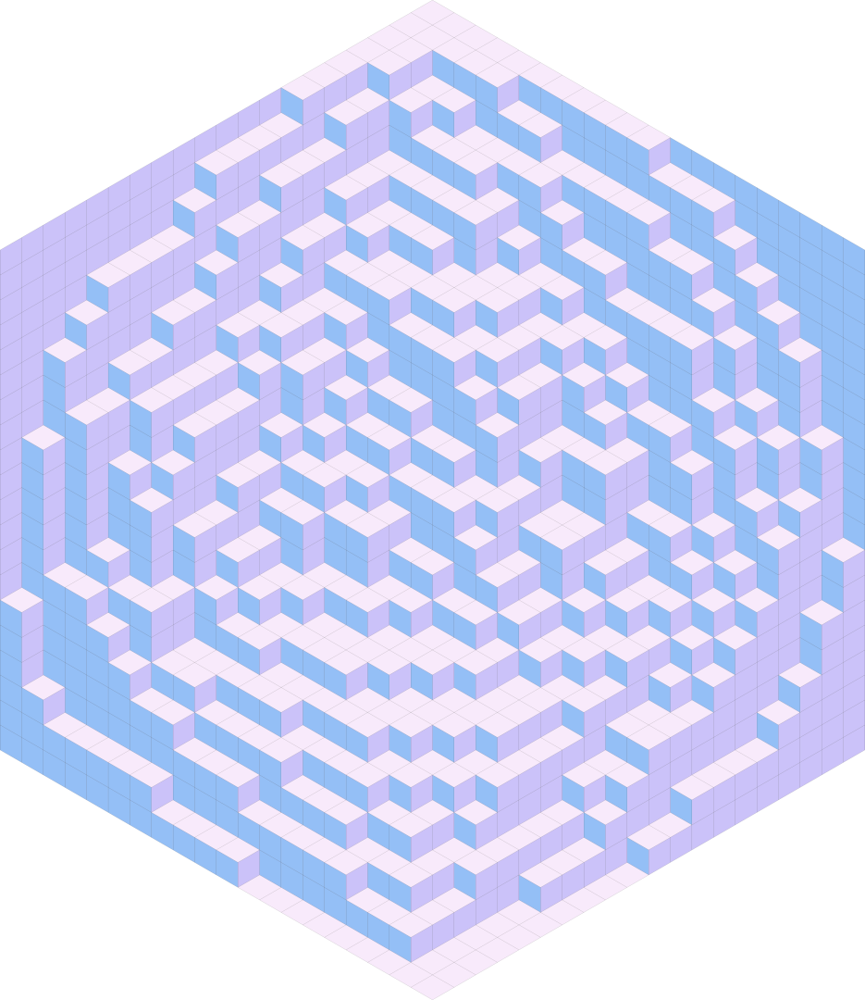

Context
=======

For this assignment, we'll be creating the illusion of having 3D cubes on a 2D plane.

In general, you can tile a hexagon with 3 types of rhombi. When colored uniquely, these
rhombi can give the appearance of filling a 3-dimensional box with little cubes. In this
assignment, these perceived cubes will be called "cubies." A cubie is made of 3 rhombi.

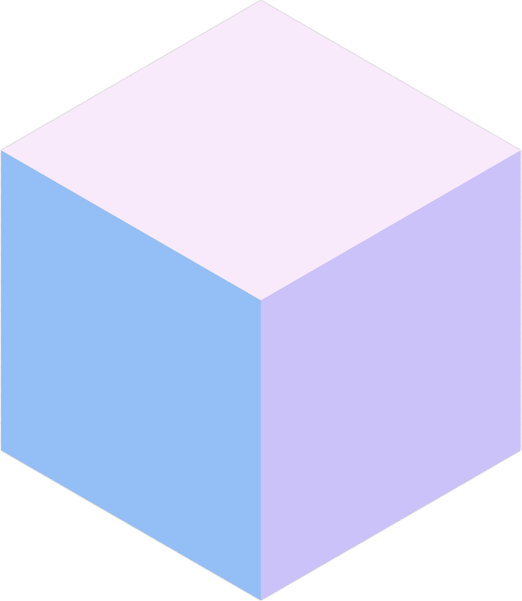

Each of the three faces can be labeled with 2D cardinal directions indicating the way
it is facing: North, Southeast, and Southwest.

An "inverted" cubie can be created by rotating the three rhombi around their common
vertex. On its own, this gives the impression of an upside-down cubie, but in context
with others, it can give the impression of negative space where a cubie isn't.

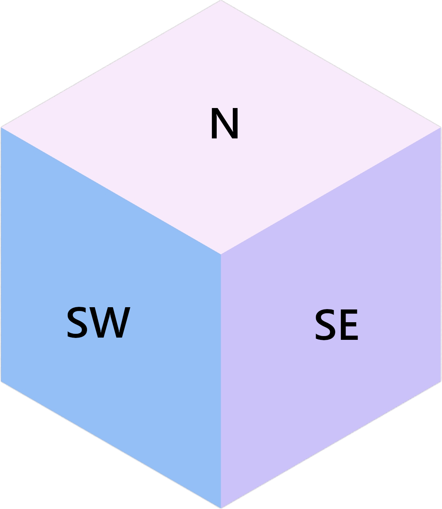

    A cubie with face directions labeled.

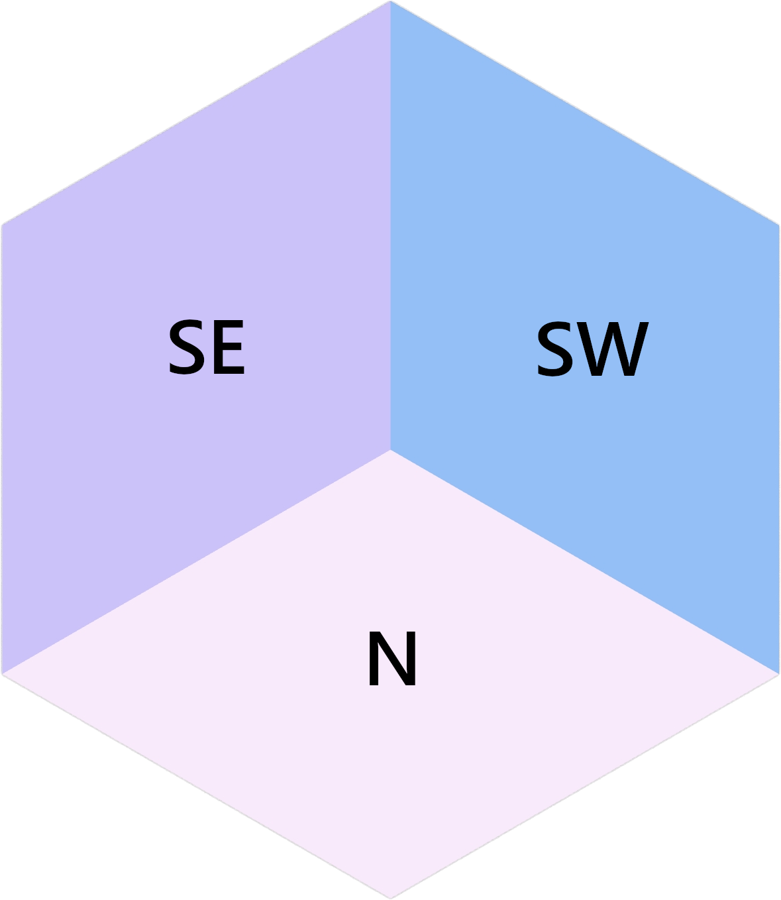

    An inverted cubie with face directions labeled.

.. rst-class:: clear-left clear-right

.. raw:: html

     

In a real 3D space, cubies can be indexed with 3 coordinates: ``u``, ``v``, and ``w``.
In 2D hexagon space, increasing ``u`` looks like moving Southeast (down and right),
increasing ``v`` looks like moving Northeast (up and right), and increasing ``w`` looks
like moving North (up). This isn't the only way to structure the coordinate system, but
it's the way it's been done here.

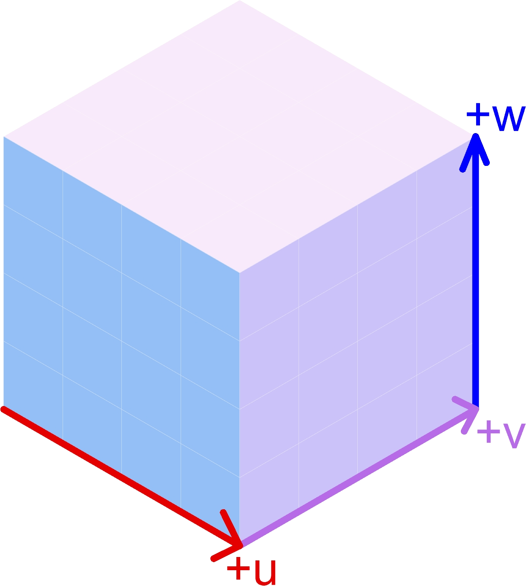

Because the hexagon is a 2D "projection" of the 3D space, you have been provided with
a function to convert coordinates ``(u, v, w)`` into coordinates on the plane:

.. py:function:: get_point(u: int, v: int, w: int) -> Vector3d

    Returns the projected cubie corner at coordinates ``(u, v, w)``. Although the
    returned type is a 3D vector, it's Z component will be 0.

    :param u: The u coordinate of the cubie corner
    :param v: The v coordinate of the cubie corner
    :param w: The w coordinate of the cubie corner

    :return: A `Rhino.Geometry.Vector3d <https://developer.rhino3d.com/api/rhinocommon/rhino.geometry.vector3d?version=8.x>`__ with the coordinates of the cubie corner
        projected onto the XY plane (Z = 0)

.. important::

    Because the hexagon is a projection of 3D space, multiple coordinates ``(u, v, w)``
    can map to the same point in the hexagon. This is a useful fact to know.

Cubies can be stacked together. One thing that will always be true of such stacks is
that a stack of cubies will never be taller than either the stack Northeast or Northwest
of it (symmetrically, a cubie stack will never be shorter than either the stack Southeast
or Southwest of it). This condition gives the tiled hexagon the appearance of containing
cubie stacks.

Configuration
=============

You have some options for configuring the output. In a group are a bunch of parameters
that affect the generation:

Parameters Group
----------------

* Extent U: how many cubies extend in the positive ``u`` direction.
* Extent V: how many cubies extend in the positive ``v`` direction.
* Extent W: how many cubies extend in the positive ``w`` direction.
* Seed: a seed to use for the random generation of the cubie stack heights. This will allow
  you to recreate results consistently.
* Preparation Strategy: After randomly generating a set of heights to use for cubie stacks,
  you have some options for how to arrange these heights in a valid configuration

  #. Random Bubble Sort: Cubie stack heights are distributed as randomly as possible.
     This trends towards an "Arctic Circle" (see `this YouTube video <https://www.youtube.com/watch?v=Yy7Q8IWNfHM>`__
     if you like math and want to learn more).
  #. Sort along U then along V: Heights are sorted along the ``u`` direction, then along
     the ``v`` direction. This trends towards an up-left slope.
  #. Sort along V then along U: Heights are sorted along the ``v`` direction, then along
     the ``u`` direction. This trends towards an up-right slope.
  #. All 0: Overrides all heights to be 0.
  #. All Max Height: Overrides all heights to be the maximum of the randomly generated
     heights. In general, this will be Extent W, but it could be shorter.

Rendering Options Group
-----------------------

If you'd like, you can change the colors used to create the materials used for the
3 different groups of faces. I chose the default colors by looking for a nice 3-color
palette on `coolors.co <https://coolors.co/palettes/popular/3>`__.

You can also change the origin point of the hexagon (the Southwest corner).

Task Description
================

In the :ref:`template Grasshopper file above <a2-download>`, you will edit the Python 3 script
node titled "Generate Faces". The node itself will be red, and it's contained in a group
with the caption "Edit Me!"

Inputs
------

The script node accepts 4 parameters:

.. py:data:: extent_u
    :type: int

    The number of cubies extending in the positive ``u`` direction.

.. py:data:: extent_v
    :type: int

    The number of cubies extending in the positive ``v`` direction.

.. py:data:: extent_w
    :type: int

    The number of cubies extending up in the positive ``w`` direction.

.. py:data:: w_heights
    :type: list[list[int]]

    ``w_heights[extent_u - u][v + 1]`` is the height of the cubie stack with a western
    corner at ``(u, v)``.

When you're implementing your code (see :ref:`Things to Implement <a2-todo>`), you'll
be provided with ``u``, ``v``, and

Explanation of ``w_heights``
^^^^^^^^^^^^^^^^^^^^^^^^^^^^

You do not need to be familiar with the structure of ``w_heights``, but if you're
curious, you can expand the dropdown and see. Being familiar with this structure is
important if you'd like to customize your own ``w_heights`` input tree for testing
or making cool pictures, or if you'd like to print out ``w_heights`` for debugging.

.. dropdown:: Specifics for ``w_heights``
    :name: w-heights-specifics

    The input accepted by ``w_heights`` is slightly different from the structure of the
    3D space imagined in the hexagon. Path ``{0;0}(0)`` is the height of the cubie stack
    in the Southernmost part of the grid. As ``u`` increases in ``{0;u}(v)``, the actual
    ``u`` coordinate of the stack decreases. This isn't important for you to mess with,
    but if you'd like to create your own ``w_heights`` instead of using one of the randomly
    provided trees from within the Grasshopper document (whether for testing or for getting
    a good picture), you'll need to know this. The idea is that the "closest stack to the
    camera" will be the first path in the tree.

    With the provided options for ``w_heights``, this ensures that for any ``u`` and ``v``,
    the height at ``{0;u}(v)`` will be at most the smaller of the heights at ``{0;u + 1}(v)``
    and ``{0;u}(v + 1)``.

    .. figure:: ../_static/images/assignment2/w-heights-structure.png
        :figwidth: 50%

    Once passed to the Python 3 script node, it gets converted to a list of lists where
    ``w_heights[0][0]`` corresponds to the path ``{0;0}(0)``. An additional 0 is placed
    at the beginning of each row, and an additional row is added so that ``w_heights[1][1]``
    corresponds to the path ``{0;0}(0)``. For a given ``(u, v)``, the western corner
    of a stack, that stack's height will be at ``w_heights[extent_u - u][v + 1]``. The
    height of the stack to the Southeast will be at ``w_heights[extent_u - u - 1][v + 1]``,
    and the height of the stack to the Southwest will be at ``w_heights[extent_u - u][v]``.
    For stacks on the Southern border, these two extra heights will be 0.

If you'd like to print out the contents of ``w_heights`` for testing, you can do so by
placing the following code above the double ``for`` loop in the "Things to Implement"
section of the code:

.. code-block:: python

    print("\n".join(str(row) for row in w_heights))

If you do this, you'll want to be familiar with the structure of ``w_heights`` (see
the :ref:`dropdown above <w-heights-specifics>`).

Outputs
-------

You'll need to populate 3 output lists with surfaces corresponding to the faces
of the cubies that can be seen, given ``w_heights``:

.. py:data:: north_faces
    :type: list[Rhino.Geometry.Surface]

    A list of North-facing faces, created with rs.AddSrfPt_.

.. py:data:: southeast_faces
    :type: list[Rhino.Geometry.Surface]

    A list of Southeast-facing faces, created with rs.AddSrfPt_.

.. py:data:: southwest_faces
    :type: list[Rhino.Geometry.Surface]

    A list of Southwest-facing faces, created with rs.AddSrfPt_.

These will be populated with the ``add_xxx_face`` functions that you'll be implementing.

.. _a2-todo:

Things to Implement
-------------------

Inside the script, scroll down to the "Things to Implement" section. Here, you'll
see 3 functions to implement:

.. py:function:: add_north_face(west_u: int, west_v: int, w: int) -> None

    Add a north-facing surface to the "north_faces" list.

    :param west_u: The u coordinate of the western corner of the face
    :param west_v: The v coordinate of the western corner of the face
    :param w: The w coordinate of the face

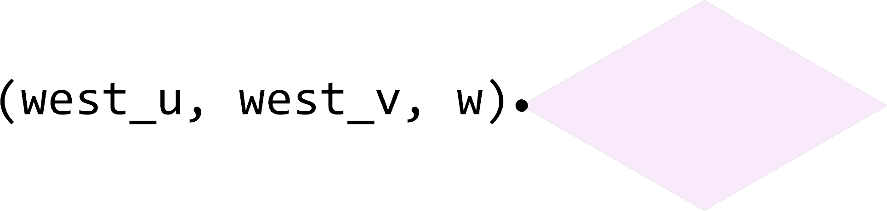

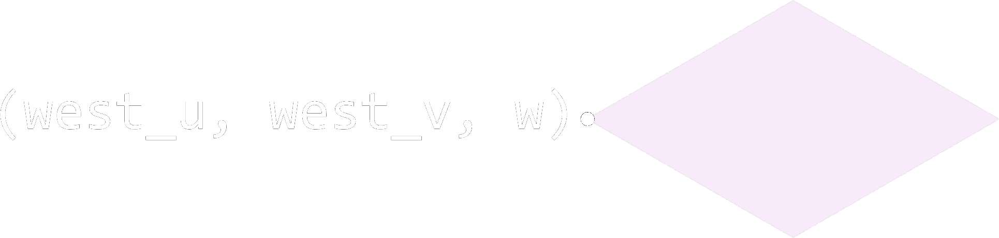

.. py:function:: add_southeast_face(u: int, southwest_v: int, southwest_w: int) -> None

    Add a southeast-facing surface to the "southeast_faces" list.

    :param u: The u coordinate of the face
    :param southwest_v: The v coordinate of the southwestern corner of the face
    :param southwest_w: The w coordinate of the southwestern corner of the face

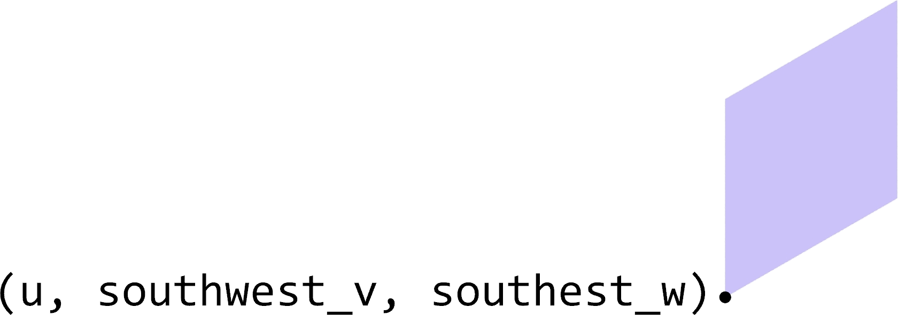

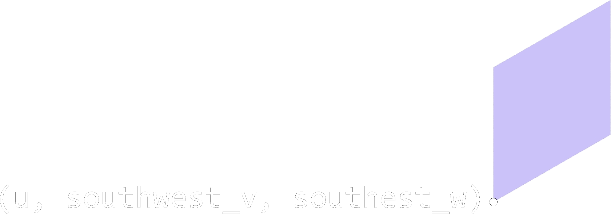

.. py:function:: add_southwest_face(southwest_u: int, v: int, southwest_w: int) -> None

    Add a southwest-facing surface to the "southwest_faces" list.

    :param southwest_u: The u coordinate of the southwestern corner of the face
    :param v: The v coordinate of the face
    :param southwest_w: The w coordinate of the southwestern corner of the face

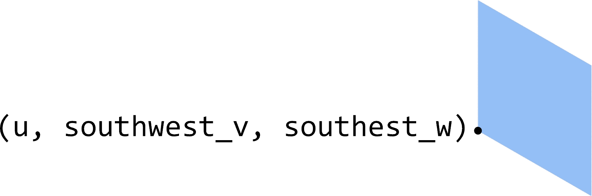

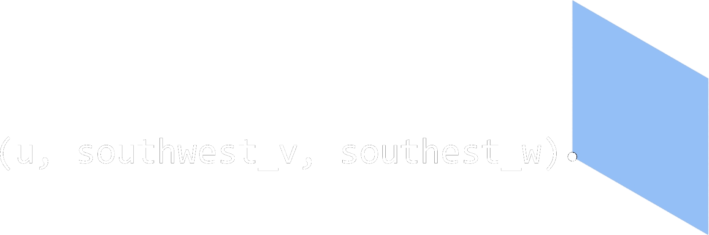

.. note::

    You'll want to use :func:`get_point` to identify the 4 corner points of each
    face your create. The input to the function is the ``(u, v, w)`` coordinates of one
    corner, and you'll need to figure out which ``(u, v, w)`` coordinates correspond to
    the other 3 corners of the face.

.. _the-nested-loop:

The Nested Loop
^^^^^^^^^^^^^^^

Finally, you'll also need to implement the contents of a double ``for`` loop that will
use these 3 functions. Inside the nested ``for`` loop, you'll see 3
``raise NotImplementedError``. For each one, you'll need to use the functions you implemented
to add some faces to the output lists. When doing this, you'll be provided with:

.. py:data:: u
    :no-index:

    The ``u`` coordinate of the westernmost corner of the current cubie stack.

.. py:data:: v
    :no-index:

    The ``v`` coordinate of the westernmost corner of the current cubie stack.

.. py:data:: w
    :no-index:

    The height of the current cubie stack.

.. py:data:: w_southeast
    :no-index:

    The height of the cubie stack to the Southeast of the current cubie stack. If the
    current cubie stack is on the Southeastern edge of the hexagon (``u = extent_u``),
    this will be 0.

.. py:data:: w_southwest
    :no-index:

    The height of the cubie stack to the Southeast of the current cubie stack. If the
    current cubie stack is on the Southwestern edge of the hexagon (``v = 0``),
    this will be 0.

To completely tile the hexagon, there are East and West "walls" that need to be filled
if there is no cubie stack in front of it. Inside the nested ``for`` loop, there are
two ``if`` statements that set up this condition, which need to contain your implementation
to fill the walls.

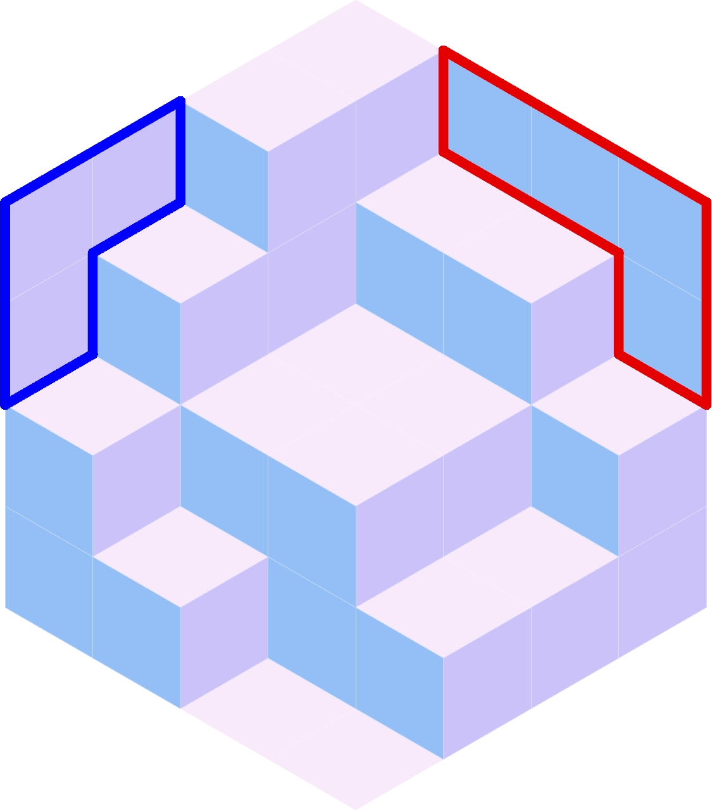

    Example configuration with the East wall outlined in red and the West wall outlined
    in blue.

Example
=======

This is an example of the inputs provided to the "Generate Faces" Python 3 script node
and the expected output.

.. _example-inputs:

Inputs
------

* ``extent_u = 4``
* ``extent_v = 4``
* ``extent_w = 4``
* ``w_heights`` is a tree containing the following information:

  .. code-block:: none
      :caption: {0;0}
      :linenos:
      :lineno-start: 0
      :class: gh-panel

      0
      1
      1
      2

  .. code-block:: none
      :caption: {0;1}
      :linenos:
      :lineno-start: 0
      :class: gh-panel

      0
      2
      2
      3

  .. code-block:: none
      :caption: {0;2}
      :linenos:
      :lineno-start: 0
      :class: gh-panel

      1
      2
      2
      3

  .. code-block:: none
      :caption: {0;3}
      :linenos:
      :lineno-start: 0
      :class: gh-panel

      2
      3
      4
      4

  After processing, ``w_heights`` will be a list containing the following information:

  .. code-block:: python

      [0, 0, 0, 0, 0]
      [0, 0, 1, 1, 2]
      [0, 0, 2, 2, 3]
      [0, 1, 2, 2, 3]
      [0, 2, 3, 4, 4]

  This was generated with the "Seed" parameter set to 524 and the "Preparation Strategy"
  set to "Random Bubble Sort".

.. _example-outputs:

Outputs
-------

The output lists each contain 16 surfaces, and the final output looks like:

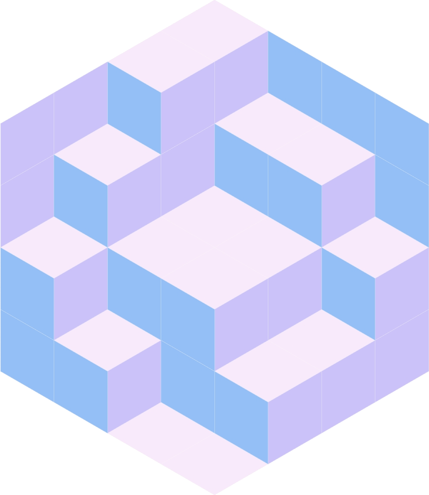

Tips
====

#. You'll want to use rs.AddSrfPt_ to create the surfaces used to represent the cubie
   faces.
#. If you want to know how many faces you'll need to output, you'll need ``extent_u * extent_v``
   North faces, ``extent_v * extent_w`` Southeast faces, and ``extent_u * extent_v``
   Southwest faces.
#. If you want to create your own input to ``w_heights``, refer to the :ref:`Dropdown
   above <w-heights-specifics>`.
#. If you want to preview the points of the hexagon, you can create a new output node
   on the Python 3 script node you're editing called "test", set the Type Hint to Point3d,
   and paste the following code at the bottom of your Python script. Comment out any
   ``raise NotImplementedError`` as needed.

   .. code-block:: python

       test = []
       for u in range(extent_u + 1):
           for v in range(extent_v + 1):
               for w in range(extent_w + 1):
                   test.append(rs.AddPoint(get_point(u, v, w)))

   Once you have this, make a Move node, connect the ``test`` output into the Geometry
   input, and connect the Origin point from the "Rendering Options" group to the Motion
   input.
#. I recommend starting by creating the North faces before trying to the Southeast and
   Southwest faces. This will help you make sure that you're getting the apparent heights
   correct.

Clarifications
==============

Inside the double-nested ``for`` loop (see :ref:`above <the-nested-loop>`), you'll have
access to 5 variables: ``u``, ``v``, ``w``, ``w_southeast``, and ``w_southwest``.

The coordinates ``(u, v, w)`` correspond to a point in 3D space. This point is projected
into 2D space with the ``get_point`` function.

``u`` and ``v`` correspond to the stack you're adding faces for. In the figures below,
each stack is shown with their corresponding ``(u, v)`` coordinates.

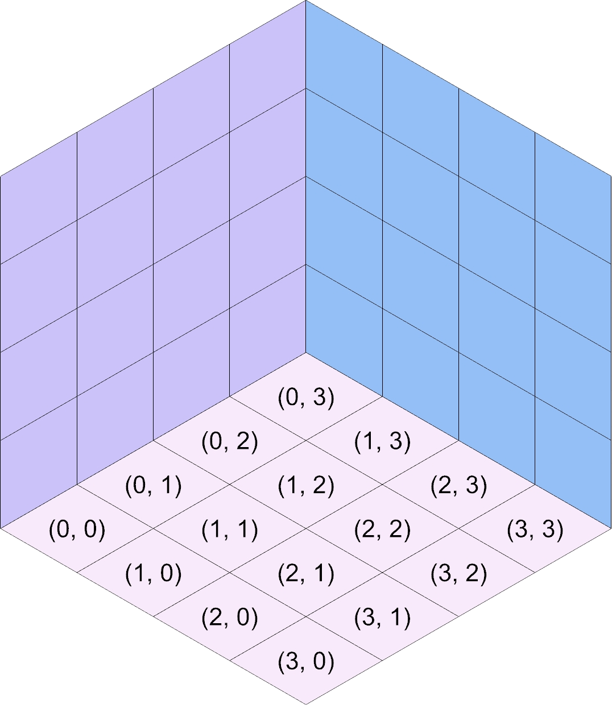

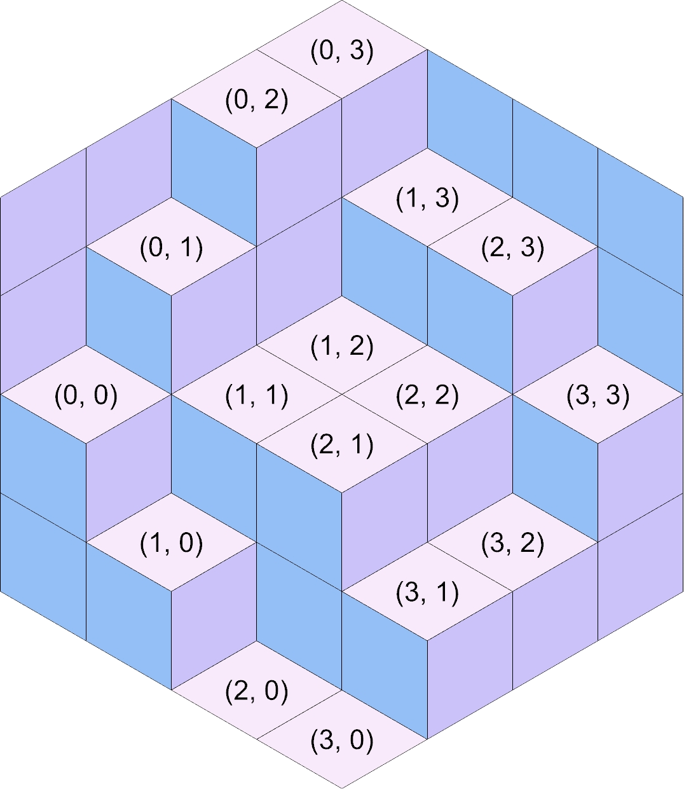

.. rst-class:: clear-left clear-right

.. raw:: html

     

When you're in the loop, ``(u, v, 0)`` corresponds to the western point of the bottom of
the stack. Similarly, ``(u, v, w)`` corresponds to the western point of the north face
of the entire stack. As such, t's recommended that you pass the ``u``, the ``v``, and the
``w`` that you have access to from within the loop into ``add_north_face`` (i.e., run
``add_north_face(u, v, w)`` verbatim).

When implementing the ``add_north_face`` function, you pass in the ``(u, v, w)`` coordinates
of the southwest corner, provided in variables as ``west_u``, ``west_v``, and ``w`` respectively.
You can get the 2D point corresponding to that corner with ``get_point(west_u, west_v, w)``.

For the other 3 corners of the face, ``w`` will stay the same, but you'll need to add
1 to ``west_u``, ``west_v``, or both when calling ``get_point`` to get the 2D points
corresponding to those corners. This will look incredibly similar to creating the closed
polylines for the parallelogram grid created in Week 5. Open the :ref:`source code dropdown <parallelogram-grid-source>`
and look down to the double-nested ``for`` loop under the comment "Generate cells" to see
how ``u`` and ``v`` were modified in that situation. Of course, this is slightly different
because you'll be using ``get_point`` with 3D coordinates instead of accessing a list of
lists. You also won't need to repeat the first corner when calling rs.AddSrfPt_.

Once you have the 4 corners, you'll need to provide them to rs.AddSrfPt_ as a list:

.. code-block:: python

    surface = rs.AddSrfPt([corner1, corner2, corner3, corner4])

In the code block above, I use a list literal to create the list passed to rs.AddSrfPt_.
Alternatively, you could create an empty list and append them each.

.. important::

    The corners provided to rs.AddSrfPt_ *MUST* each be the output of ``get_point``.
    ``u``, ``v``, and ``w`` (and any modified names like ``west_u``) are 3D coordinates
    that need to be converted to the corresponding 2D coordinates with ``get_point``.

Southeast and Southwest Faces
-----------------------------

Creation of the Southeast and Southwest faces is facilitated by the two variables ``w_southeast``
and ``w_southwest``, respectively. In the :ref:`figures above <indexing-stacks>`, take
a look at the stack labeled ``(2, 1)``. The height of the stack is 2 (``w = 2``), the
height of the stack to the Southeast at ``(3, 1)`` is 1 (``w_southeast = 1``), and the
height of the stack to the Southwest at ``(2, 0)`` is 0 (``w_southwest = 0``).

The difference in heights to the Southeast means 1 Southeast face will need to be added with
``add_southeast_face``. I encourage you to provide the Southwest corner ``(u, v, w)``
coordinates of these faces to ``add_southeast_face``. For Southeast faces, ``u`` will
always be the same, but ``v`` and ``w`` will need to vary in order to find the other 3
corners. I suggest providing the Southwest instead of the Northwest corner of the face
so that you can create 1 face for each ``w_step`` ranging from ``w_southeast`` to ``w``
(not including ``w``).

.. admonition:: Important!!!
    :class: error

    That last sentence is a big hint, suggesting how you might want to create a ``for``
    loop using :external+python:py:class:`range`.

Similarly, the difference in heights to the Southwest means 2 Southwest faces will need
to be added with ``add_southwest_face``, 1 for each ``w_step`` ranging from ``w_southwest``
to ``w`` (not including ``w``). For Southwest faces, ``v`` is constant, while ``u`` and
``w`` need to vary to find the other 3 corners.

Additionally, if the stack you're working on is against the wall and ``w`` is *not* ``w_extent``,
you'll need to add faces for each ``w_step`` ranging from ``w`` to ``w_extent`` (not including
``w_extent``) on the wall.

.. admonition:: ``(u, v, w)`` for Southeast and Southwest Faces
    :class: hint

    When adding Southeast and Southwest with ``add_southeast_face`` or ``add_southwest``
    face, you'll sometimes need to add 1 to either the ``u`` or ``v`` provided to you
    in the nested loop when calling the functions. Remember that you want to provide
    the functions with the ``(u, v, w)`` coordinates of the Southwest corner of the face.
    Increasing ``u`` by 1 shifts the corresponding 2D point (computed with ``get_point``)
    down and right. Increasing ``v`` by 1 shifts the corresponding 2D point up and right.

    Take some time to figure out when you'll need to add 1 to ``u`` and when to add 1
    to ``v``. Or you can just try out different things and see what works.

Submission
==========

Deliverables
------------

When submitting your assignment, upload a .gh file containing your solution. Also
create a handful (minimum 5) of pictures showcasing the rigorousness of your solution.
This means you should play with different extents, seeds, and preparation strategies.
Feel free to also play with the colors used for each face type or create your own inputs
to ``w_heights``.

If you haven't made renderings from Grasshopper, I'd suggest right-clicking the Custom
Preview node, selecting Bake, changing your viewport to use the Rendered model view,
and print out the surfaces you create to a picture.

Rubric
------

======= ===========================================================================================================================
Points  Requirements
======= ===========================================================================================================================
15      Your solution correctly makes a "filled" hexagon when the preparation strategy is set to "All Max Height".
15      Your solution correctly makes an "empty" hexagon when the preparation strategy is set to "All 0".
15      Your solution does not create any overlapping surfaces.
15      Your solution creates a completely tiled hexagon, with dimensions matching the Extent parameters.
40      You have created at least 5 pictures showcasing the rigorousness of your solution.
======= ===========================================================================================================================

.. _rs.AddSrfPt: https://developer.rhino3d.com/api/RhinoScriptSyntax/#surface-AddSrfPt
