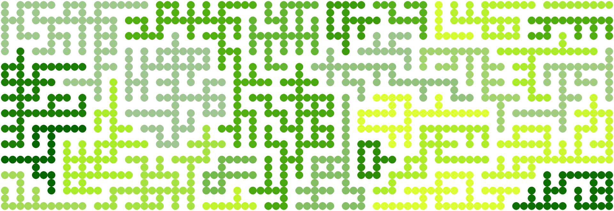
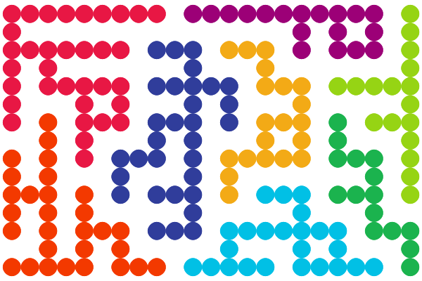
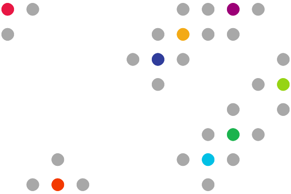

=============================
Assignment 3: Cluster Sprawls
=============================

:bdg-danger-line:`Due: Friday, Feb 21, 2025`

.. important::
    :name: a3-download

    Download the template Grasshopper document here: :download:`A3 Boilerplate <../_static/grasshopper-files/A3-boilerplate.gh>`\ .

Context
=======

For this assignment, you'll be writing code that interacts with PRNG functions from
Python's :external+python:py:mod:`random` module and with some grid-based geometry
definitions to create interesting patterns.

In these patterns, you'll have groups of points defined on a grid that are randomly
connected into *clusters* of points. In the picture at the top of the page and right below,
each cluster is colored differently.

In the Grasshopper definition, the points involved in the clusters are converted into
circles that form the visual output. Creating these clusters starts with *seeds*,
individual points chosen at random, from which the clusters will expand and "sprawl"
until all points in the grid have been assigned to a cluster.

During each step of the sprawl, grid points on the frontier (those that are adjacent to
points that have joined a cluster) are identified, and one frontier point is added to the
smallest cluster it is adjacent to.

    *The seeds of the above example cluster sprawl.*

    *The frontier points at the first step of the sprawl are shown in grey.*

.. rst-class:: clear-left clear-right

.. raw:: html

     

In the picture showing the seeds with the initial frontier, notice how the seeds and frontier
points are actually on a grid more sparse than the example crawl. This helps to facilitate
a constant spacing between each cluster. In order to fill the gaps within a cluster,
as points are added to the cluster, so is an *edge*. Internally, this is a 2-tuple:
``(start_point, end_point)``. When outputted, these edge points are placed as circles
exactly halfway between ``start_point`` and ``end_point``, forming the connections
seen in the example. When a point is added to a cluster, one of the neighboring points in
that cluster is selected for creating an edge between the added point and that selected point.

Additionally, points have a chance to form a second edge between an additional
neighboring point in the cluster they're being added to, creating additional visual interest.

Configuration
=============

You have some options for configuring the output. In a group are a bunch of parameters
that affect the generation:

Parameters Group
----------------

* Grid Height: The height of the grid.
* Grid Width: The width of the grid.
* Seed Count: The number of cluster seeds to create. This will also be the number of
  clusters in the final output.
* PRNG Seed: The seed provided to the pseudo-random number generator in the
  :external+python:py:mod:`random` module via :external+python:py:func:`random.seed`.
* Two-Edges Chance: The probability that adding a point to a cluster will result
  in creating two edges, if possible.

Rendering Options Group
-----------------------

If you'd like, you can change some options used during rendering, like the origin
of the grid, a uniform scaling factor, and a gradient that defines the colors
used to differentiate groups.

Task Description
================

In the :ref:`template Grasshopper file above <a3-download>`, you will edit the Python 3 script
node titled "Create Clusters". The node itself will be red, and it's contained in a group
with the caption "Implement Me!"

Type Aliases
------------

Near the top of the file, you'll see a couple of type aliases that are used in
type hints throughout the file. Using type aliases makes type-hinting functions and
variables much easier. The following type aliases are defined for you:

* ``GridPoint``: equivalent to ``tuple[int, int]``

  * Points in the grid are identified by an ``(x, y)`` tuple, which are later converted to
    ``Vector3d``\ s.

* ``ClusterEdge``: equivalent to ``tuple[GridPoint, GridPoint]``

  * Edges in a cluster are identified by a ``(start_point, end_point)`` tuple, which are
    later converted to ``Vector3d``\ s as the midpoint between ``start_point`` and
    ``end_point``.

* ``ClusterPoints``: equivalent to ``dict[int, set[GridPoint]]``

  * Clusters are stored in a map from the cluster number to the set of points contained
    in the cluster. Technically, this could be a list of sets of points, but I used a
    dictionary when I originally made the solution to this problem, so this is what you'll
    get.

* ``ClusterEdges``: equivalent to ``dict[int, list[ClusterEdge]]``

  * Cluster edges are stored in a map from the cluster number to the list of edges created
    to connect the cluster points. Technically, this could also be a list instead of
    a dictionary.

Things to Implement
-------------------

Inside the script, scroll down to the "Implementation" section. Here, you'll be implementing
two functions:

.. py:function:: get_cluster_seeds(unclaimed: set[GridPoint]) -> list[GridPoint]:

    Sample ``cluster_seed_count`` ``GridPoint``\ s randomly from ``unclaimed``, returning
    the sampled list.

.. py:function:: select_point_to_add(frontier: list[GridPoint]) -> GridPoint:

    Select a random ``GridPoint`` from the frontier of unclaimed ``GridPoint``\ s
    adjacent to the current clusters.

``create_clusters()``
^^^^^^^^^^^^^^^^^^^^^

Additionally, you'll see a function called ``create_clusters()``. Inside of this, you'll
need to create the logic that connects a randomly-selected frontier point to a cluster,
and you'll need to do some bookkeeping.

.. _edge-creation:

At the first ``raise NotImplementedError`` in this function, you'll need to create
an edge or two:

1. Select a random point from the ``target_cluster_points`` to use as the edge endpoint.
2. Add the new ``ClusterEdge`` to ``cluster_edges[target_cluster]`` (this will be a 2-tuple with to_add and your selected endpoint).
3. Remove the selected endpoint from ``target_cluster_points``.
4. If there are any remaining ``GridPoints`` in ``target_cluster_points``:

   a. Sample a random number.
   b. If that random number is less than or equal to ``two_edges_chance``:

      i.  Pick a second random ``GridPoint`` from ``target_cluster_points``.
      ii. Create a new edge tuple with ``to_add`` and this second random ``GridPoint``.
      iii. Add this new edge to ``cluster_edges[target_cluster]``.

.. _bookkeeping:

At the second ``raise NotImplementedError`` in ``create_clusters()``, you'll need to:

1. Add ``to_add`` to ``claimed``, the set of claimed ``GridPoint``\ s.
2. Add ``to_add`` to the set of ``GridPoint``\ s at ``cluster_points[target_cluster]``.
3. Remove ``to_add`` from ``unclaimed``.

.. danger::

    If you do not correctly remove ``to_add`` from ``unclaimed``, the ``while`` loop
    inside ``create_clusters()`` will loop forever, requiring you to force-crash Rhino.
    Do this first, or create some way to escape the loop, such as putting ``break`` somewhere
    inside the loop.

Tips
====

#. It's very possible that you'll make an endless loop for yourself if you don't do the
   bookkeeping correctly. I'd suggest starting with that, and if you're extra worried,
   you can also add an additional loop condition. Replace the ``while unclaimed:`` line
   with:

   .. code-block:: python

       loops = 0
       while loops < grid_height * grid_width and unclaimed:
           loops += 1

   This will break you out of the loop after enough iterations to guarantee that each
   point has been added to a cluster.

#. You can comment out the ``raise NotImplementedError``\ s in the loop where you'll need
   to create edges, and you'll be able to see if your implementations of :func:`get_cluster_seeds`
   and :func:`select_point_to_add` works as expected. I recommend changing the gradient
   to make the different clusters colored a little more obviously than the default green.
#. Take a look back at the Week 6 :doc:`page on randomness <../week6/randomness>` for details
   on functions that you might find helpful during your implementation.

Submission
==========

.. admonition:: A Note on Randomness

    This problem requires the use of the :external+python:py:mod:`random` module. This uses
    a pseudo-random number generator internally, which means any sequence of function calls
    is completely deterministic for a given seed. Importantly, if you use different functions
    from what I used, or if you use the same functions in a slightly different order, **your
    solution will not produce exactly the same outputs as mine**.

    This is perfectly fine. I won't be checking that your solution produces the exact same
    results as mine, but I will be checking that you actually do incorporate randomness
    from the :external+python:py:mod:`random` module.

Deliverables
------------

When submitting your assignment, upload a .gh file containing your solution. Also
create a handful (minimum 5) of pictures showcasing the rigorousness of your solution
and its incorporation of randomness. This means you should play with different grid extents,
seeds, two-edge chances, and seed counts. Feel free to also play with the colors used.

If you haven't made renderings from Grasshopper, I'd suggest right-clicking the Custom
Preview node, selecting Bake, changing your viewport to use the Rendered model view,
and print out the surfaces you create to a picture.

Rubric
------

======= ===========================================================================================================================
Points  Requirements
======= ===========================================================================================================================
15      Your implementation for :func:`get_cluster_seeds` randomly samples ``GridPoint``\ s from ``unclaimed``,
        returning a list of ``cluster_seed_count`` unique ``GridPoint``\ s.
15      Your implementation for :func:`select_point_to_add` randomly selects a ``GridPoint`` from ``frontier`` to return.
15      Your implementation of the :ref:`edge creation process <edge-creation>` randomly selects a ``GridPoint`` from
        ``target_cluster_points`` and creates a ``ClusterEdge`` between it and ``to_add``.
10      Your implementation of the :ref:`edge creation process <edge-creation>` supports creating a second ``ClusterEdge``
        between ``to_add`` and a random ``GridPoint`` from ``target_cluster_points``, when a random roll is less than or equal to
        ``two_edges_chance``.
5       Your implementation of the :ref:`bookkeeping <bookkeeping>` correctly performs all 3 required actions.
40      You have created at least 5 pictures showcasing the rigorousness of your solution.
======= ===========================================================================================================================
