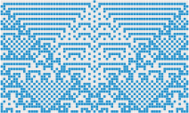
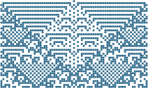
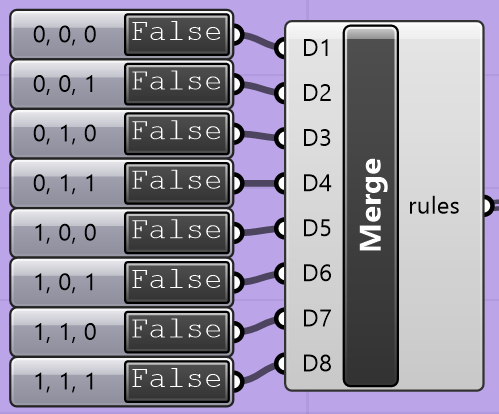
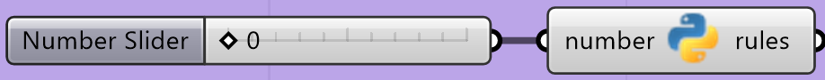

===========================================
Assignment 4: Elementary Cellular Automaton
===========================================

:bdg-danger-line:`Due: Friday, March 7, 2025`

.. important::
    :name: a4-download

    Download the template Grasshopper document here: :download:`A4 Boilerplate <../_static/grasshopper-files/A4-boilerplate.gh>`\ .

Context
=======

During Week 8, we introduced :doc:`../week8/1-cellular-automata`, contextualized
with Conway's Game of Life, showing how something so separated from design can make for
interesting geometry when framed in the right way. For this assignment, we'll be doing
something similar, but using much a simpler, 1-dimensional cellular automaton. With this,
instead of converting the grid to cubes and stacking generations on top of each other,
each generation is a :math:`1 \times n` grid that we can stack on top of each other
to make a :math:`m \times n` image.

Rules
-----

In the Game of Life, a cell in the grid is updated by checking its state and the states
of its `Moore neighborhood <https://en.wikipedia.org/wiki/Moore_neighborhood>`__. In an
elementary cellular automaton, the neighborhood of any cell are the two cells to its left
and right. This means the rules that we could devise are based on the states of the cell
itself and its two neighbors. For this assignment, there are only two valid states ("on"
and "off", :math:`0` or :math:`1`), which means there are :math:`2^3 = 8` possible
configurations for a cell and its neighborhood. Given one of these configurations, we could
either choose to say that a state with that configuration will be either on or off in the
next generation, meaning there are :math:`2^8 = 256` possible rules for the type of
elementary cellular automata we're making in this assignment.

An example rule is: :math:`0, 1, 1 \rightarrow \text{True}`, meaning if the left neighbor
of the cell is off, the cell itself is on, and its right neighbor is on, in the next
generation, the cell will be on. The opposite rule would be :math:`0, 1, 1 \rightarrow \text{False}`,
where given the exact same configuration in the current generation, the cell would be
off in the next generation.

.. figure:: https://upload.wikimedia.org/wikipedia/commons/e/e2/One-d-cellular-automate-rule-30.gif
    :target: https://commons.wikimedia.org/wiki/File:One-d-cellular-automate-rule-30.gif
    :figwidth: 75%

    An example of how a set of rules are applied to a current generation. The rules are
    depicted as a 3-cell neighborhood above what the state of the center cell will be
    in the next generation.

    *Credit: Cormullion,* |CC_BY-SA_4.0|_\ *, via Wikimedia Commons.*

.. _boundary-conditions:

Boundary Conditions
-------------------

As with the Game of Life, elementary cellular automata exist on an infinite grid.
Unfortunately for us, we can't really do this very well. Instead, we can only work with
a finite 1-dimensional grid. For the cell at the very beginning or the cell at the very
end, their neighborhood can't be directly found, so we need to come up with some way to
provide it with fake information about its neighborhood. This gives us a handful of
possibilities for what to use as the value for the missing neighbor:

#. Zero: treat the missing neighbor as being off (having a value of :math:`0`).
#. One: treat the missing neighbor as being on (having a value of :math:`1`).
#. Wrap: treat the missing neighbor as having the same state as the cell on the other
   boundary, as if the grid were a connected ring.
#. Extend: treat the missing neighbor as having the same state as this cell.

You'll be able to choose the boundary conditions for both the left and right boundaries
of the grid.

.. _first-generation-type:

First Generation Type
---------------------

The first generation can be one of many options:

#. Left 1: every cell is off except for the leftmost.

   .. figure:: ../_static/images/assignment4/left1-light.svg
       :figclass: only-light no-left-margin no-bottom-margin
       :figwidth: 60%
       :width: 100%
       :align: left

   .. figure:: ../_static/images/assignment4/left1-dark.svg
       :figclass: only-dark no-left-margin no-bottom-margin
       :figwidth: 60%
       :width: 100%
       :align: left

   .. raw:: html

       

#. Centered 1: every cell is off except for the center cell.

   .. figure:: ../_static/images/assignment4/centered1-light.svg
       :figclass: only-light no-left-margin no-bottom-margin
       :figwidth: 60%
       :width: 100%
       :align: left

   .. figure:: ../_static/images/assignment4/centered1-dark.svg
       :figclass: only-dark no-left-margin no-bottom-margin
       :figwidth: 60%
       :width: 100%
       :align: left

   .. raw:: html

       

#. Right 1: every cell is off except for the rightmost.

   .. figure:: ../_static/images/assignment4/right1-light.svg
       :figclass: only-light no-left-margin no-bottom-margin
       :figwidth: 60%
       :width: 100%
       :align: left

   .. figure:: ../_static/images/assignment4/right1-dark.svg
       :figclass: only-dark no-left-margin no-bottom-margin
       :figwidth: 60%
       :width: 100%
       :align: left

   .. raw:: html

       

#. Left 0: every cell is on except for the leftmost.

   .. figure:: ../_static/images/assignment4/left0-light.svg
       :figclass: only-light no-left-margin no-bottom-margin
       :figwidth: 60%
       :width: 100%
       :align: left

   .. figure:: ../_static/images/assignment4/left0-dark.svg
       :figclass: only-dark no-left-margin no-bottom-margin
       :figwidth: 60%
       :width: 100%
       :align: left

   .. raw:: html

       

#. Centered 0: every cell is on except for the center cell.

   .. figure:: ../_static/images/assignment4/centered0-light.svg
       :figclass: only-light no-left-margin no-bottom-margin
       :figwidth: 60%
       :width: 100%
       :align: left

   .. figure:: ../_static/images/assignment4/centered0-dark.svg
       :figclass: only-dark no-left-margin no-bottom-margin
       :figwidth: 60%
       :width: 100%
       :align: left

   .. raw:: html

       

#. Right 0: every cell is on except for the rightmost.

   .. figure:: ../_static/images/assignment4/right0-light.svg
       :figclass: only-light no-left-margin no-bottom-margin
       :figwidth: 60%
       :width: 100%
       :align: left

   .. figure:: ../_static/images/assignment4/right0-dark.svg
       :figclass: only-dark no-left-margin no-bottom-margin
       :figwidth: 60%
       :width: 100%
       :align: left

   .. raw:: html

       

#. Randomized: each cell is given a random state.

   .. figure:: ../_static/images/assignment4/randomized-light.svg
       :figclass: only-light no-left-margin no-bottom-margin
       :figwidth: 60%
       :width: 100%
       :align: left

       *Created with seed: 320*

   .. figure:: ../_static/images/assignment4/randomized-dark.svg
       :figclass: only-dark no-left-margin no-bottom-margin
       :figwidth: 60%
       :width: 100%
       :align: left

       *Created with seed: 320*

   .. raw:: html

       

Technically, you could curate the first generation to have a specific configuration,
but the boilerplate doesn't provide this option on its own. You'd have to change the
provided code in order for this to work.

Configuration
=============

Parameters Group
----------------

* Length: the length of the 1-dimensional grid to use (snaps to odd values).
* Generation Count: the number of generations to include in the output.
* Value at Left Boundary: left boundary condition (see :ref:`above <boundary-conditions>`).
* Value at Right Boundary: right boundary condition (see :ref:`above <boundary-conditions>`).
* First Generation Type: the type of configuration to use as the first generation
  (see :ref:`above <first-generation-type>`).
* Seed: if using a Randomized first generation, the seed to use for the random number
  generator.

Rule Selection Group
--------------------

You have two options for creating the list of rules to use when calculating generations.
The first way is to use the toggle switches that get passed into a Merge component,
which is then provided to the ``rules`` parameter of the Python 3 Script component.
These toggle switches are named with the configuration of a cell and its neighborhood
at the current generation, with the ``True`` or ``False`` value being used to determine
the state of that cell at the next generation. For example, the toggle switch named
``0, 1, 1`` determines the state of a cell if, in the previous generation, it was turned
on, its left neighbor was off, and its right neighbor was on. If the switch is set to
``True``, it will be on; if set to ``False``, it will be off.

Alternatively, below these toggle switches, you could set the number in the slider
to a number between 0 and 255 and connect the output of the Python 3 Script component
the slider is connected to into the ``rules`` parameter of the main Python 3 Script
component. As mentioned earlier, there are 256 possible sets of rules for an elementary
cellular automaton, and this lets you choose the number directly. If you'd like to see
a preview of what these can look like, there's a `helpful graphic on Wikipedia <https://en.wikipedia.org/wiki/Elementary_cellular_automaton#/media/File:Elementary_cellular_automaton_-_all_the_rules.png>`__
that connects the rule number to what the output would look like on an infinite grid
with the first generation set equivalently to "Centered :math:`1`\ ". Note that these
are demonstrated on an infinite grid, which means your output will probably look a little
different because you have to worry about boundary conditions.

Rendering Options Group
-----------------------

* Cell Size: the side length (in model units) of the grid cells.
* Surface Scale: the scale of the surfaces created relative to the size of the grid cells.
  If this is less than 1, there will be gaps between the created surfaces. You'll get
  weird results setting this greater than 1, but it's kind of cool to see, particularly
  at values around 1.5.
* On Color: the color to use for cells that are on.
* Off Color: the color to use for cells that are off.

.. _example-config:

Example
-------

The image at the top of the page was created with the following configuration:

* Length: 75
* Generation Count: 45
* Value at Left Boundary: One
* Value at Right Boundary: One
* First Generation Type: Centered 1
* Seed: N/A
* Rule: 105 (from top to bottom: ``True``, ``False``, ``False``, ``True``, ``False``, ``True``, ``True``, ``False``)
* Cell Size: 1
* Surface Scale: 0.95

Task Description
================

In the :ref:`template Grasshopper file above <a4-download>`, you will edit the Python 3
Script node titled "Compute Generations". The node itself will be red, and it's contained
in a group with the caption "Implement Me!"

Type Aliases
------------

As with Assignment 3, I've provided you with some type aliases that are meant to make
type hints easier to understand. The following aliases are provided to you:

.. py:type:: CellState
    :canonical: typing.Literal[0, 1]

    A cell's state can either be off (``0``, ``False``) or on (``1``, ``True``).

.. py:type:: Neighborhood
    :canonical: tuple[CellState, CellState, CellState]

    A cell's neighborhood is represented as a 3-tuple, ``(a, b, c)``, where ``a`` is
    the state of its left neighbor, ``b`` is its own state, and ``c`` is the state of
    its right neighbor.

.. py:type:: Generation
    :canonical: typing.Sequence[CellState]

    Each generation is represented as a sequence of states representing the entire grid.

.. important::

    These values are only used for type hints on variables and functions. It's good
    practice to not use these names as variables because you can confuse a static type
    checker or yourself.

    These aliases are important so I can explain in these instructions what you need to
    do without having to spell everything out.

Helpful Data
------------

You are provided with some variables that you might find helpful:

.. py:data:: rules
    :type: dict[Neighborhood, CellState]

    A map from :type:`Neighborhood`\ s to `CellState`\ s, where the value at a given
    :type:`Neighborhood` the `CellState` to use in the next :type:`Generation` for a cell with
    that :type:`Neighborhood` in the current :type:`Generation`.

.. py:data:: length
    :type: int

    The length of the 1-dimensional grid.

.. py:data:: num_generations
    :type: int

    The number of generations to compute, including the first.

Helper Functions
----------------

You are provided with three functions that you might find helpful:

.. py:function:: left_boundary_behavior(gen: Generation) -> CellState

    Provides the value to use as the left neighbor's :type:`CellState` for the
    leftmost cell in the grid.

    :param gen: The current :type:`Generation`.
    :return: The :type:`CellState` to use, determined by the ``left_boundary_condition``
        component input.

.. py:function:: right_boundary_behavior(gen: Generation) -> CellState

    Provides the value to use as the right neighbor's :type:`CellState` for the
    rightmost cell in the grid.

    :param gen: The current :type:`Generation`.
    :return: The :type:`CellState` to use, determined by the ``right_boundary_condition``
        component input.

.. py:function:: get_first_generation() -> Generation:

    Computes and returns the first :type:`Generation`.

    :return: The first :type:`Generation`, determined by the ``first_generation_type``
        component input.

Things to Implement
-------------------

Inside the script, scroll down to the "Implementation" section. Here, you'll be implementing
four functions:

.. py:function:: get_neighborhood(gen: Generation, index: int) -> Neighborhood

    Compute the :type:`Neighborhood` of the grid cell at the provided index.

    :param gen: The current :type:`Generation`.
    :param index: The index of the grid cell to compute the :type:`Neighborhood` of.
    :return: The :type:`Neighborhood` of the grid cell at the provided index.

.. admonition:: Implementation Details
    :class: note

    #. Return a 3-tuple: ``(gen[index - 1], gen[index], gen[index + 1])``
    #. If ``index == 0``, use :func:`left_boundary_behavior(gen) <left_boundary_behavior>`
       instead of ``gen[index - 1]``.
    #. If ``index == length - 1``, use :func:`right_boundary_behavior(gen) <right_boundary_behavior>`
       instead of ``gen[index + 1]``.

    .. important::

        It's incredibly important that you output a :external+python:class:`tuple` here,
        and not something else. If you don't, your implementation of :func:`next_state`
        won't work.

.. py:function:: next_state(gen: Generation, index: int) -> CellState

    Compute the next :type:`Generation`\ 's :type:`CellState` of the grid cell at the
    provided ``index``.

    :param gen: The current :type:`Generation`.
    :param index: The index of the grid cell to compute the next :type:`CellState` of.
    :return: The next :type:`CellState` of the grid cell at the provided ``index``.

.. admonition:: Implementation Details
    :class: note

    #. Compute the :type:`Neighborhood` of ``gen[index]`` using the
       :func:`get_neighborhood` function.
    #. Get the :type:`CellState` corresponding to the computed :type:`Neighborhood`. This
       can be done by accessing :data:`rules` with the :type:`Neighborhood` as the key.
    #. Return the :type:`CellState` determined in the previous step.

.. py:function:: next_generation(gen: Generation) -> Generation

    Compute the :type:`Generation` following a provided :type:`Generation`.

    :param gen: The current :type:`Generation`.
    :return: The next :type:`Generation`.

.. admonition:: Implementation Details
    :class: note

    Create a new sequence (:external+python:class:`tuple` or :external+python:class:`list`)
    according to the following:

    #. For each ``index`` in ``range(length)``:

       #. Compute the :func:`next_state` for the cell at that index.
       #. Include the computed :type:`CellState` in your output :type:`Generation`.

.. py:function:: generate() -> list[Generation]

    Compute all :type:`Generation`\ s, returning the :external+python:class:`list` of
    computed :type:`Generation`\ s.

    :return: A :external+python:class:`list` of computed :type:`Generation`\ s.

.. admonition:: Implementation Details
    :class: note

    #. Create an empty :external+python:class:`list` called ``generations``.
    #. Compute the first :type:`Generation` with :func:`get_first_generation` and save
       it to a variable called ``gen``.
    #. Loop over ``range(num_generations)``, doing the following for each iteration:

       #. Append ``gen`` to ``generations``.
       #. Update ``gen`` with the output from :func:`next_generation`.

    #. Return ``generations``.

Tips
====

#. As you're debugging, I suggest using only a single rule set to ``True``. This should
   help you determine if your implementation makes sense.

   * Recall what each rule means, and it should make it more clear whether your implementation
     is correct or not.

#. As you're debugging, you'll probably want to switch around your First Generation Type
   while setting a single rule to ``True`` because some of the rules won't do anything
   with Centered 1.
#. Correctness is highly important for this assignment due to its simplicity. You definitely
   want to make sure each rule works on its own.

   * You'll also want to make sure that your boundary conditions work as expected, as well.

Submission
==========

.. admonition:: A Note on Correctness

    Correctness is hugely important for this assignment. If your implementation does not
    produce exactly the same thing as mine, you have implemented something incorrectly.

    As such, you will need to include the configurations you used when producing your
    graphics.

.. _a4-deliverables:

Deliverables
------------

When submitting your assignment, upload a .gh file containing your solution. Also create
a handful of pictures (minimum 5) showcasing the rigorousness of your solution. With each
image, include either a text description or a picture of the configuration you used to
generate them (see :ref:`the above example <example-config>`). There are some constraints
on the types of configurations you can use when creating your pictures:

* Only one of your pictures may have less than two rules set to ``True``.

  * If using the slider, only one of your pictures can be created with one of ``0``,
    ``1``, ``2``, ``4``, ``8``, ``16``, ``32``, ``64``, or ``128``.

* You **must** showcase each of the boundary conditions for the left and right boundaries.
  You can mix and match as much as you like.

  * At a bare minimum, you could set both boundary conditions to the same value, choosing
    one value per image. Your fifth image can then use whatever you'd like as the boundary
    conditions.

These constraints ensure that your pictures demonstrate the completeness of your implementation.

Rubric
------

======= ===========================================================================================================================
Points  Requirements
======= ===========================================================================================================================
30      You have created at least 5 pictures showcasing the rigorousness of your solution, and you have included the configurations
        used to generate them.
30      The configurations used to create your pictures adhere to the constraints outlined in the
        :ref:`Deliverables <a4-deliverables>` section.
10      Your implementation of :func:`get_neighborhood` correctly computes the :type:`Neighborhood` of any given cell ``index``
        in any given ``gen``, including the boundary conditions.
10      Your implementation of :func:`next_state` correctly computes the next :type:`CellState` of any given cell ``index`` in any
        given ``gen`` with any given :data:`rules`, based on your implementation of :func:`get_neighborhood`.
10      Your implementation of :func:`next_generation` correctly computes the next :type:`Generation` of any given ``gen``,
        based on your implementation of :func:`next_state`.
10      Your implementation of :func:`generate` correctly provides a list of :data:`num_generations` :type:`Generation`\ s,
        starting with the first generation calculated by :func:`get_first_generation`, with each :type:`Generation` afterwards
        being calculated by your implementation of :func:`next_generation`.
======= ===========================================================================================================================

.. note::

    The implementation requirements are all based on the previous implementation
    requirement. This means that even if your implementation of one function is
    incorrect, if you're calling it correctly in the appropriate function, you'll get
    full credit for the calling function.

.. |CC_BY-SA_4.0| replace:: *CC BY-SA 4.0*
.. _CC_BY-SA_4.0: https://creativecommons.org/licenses/by-sa/4.0
