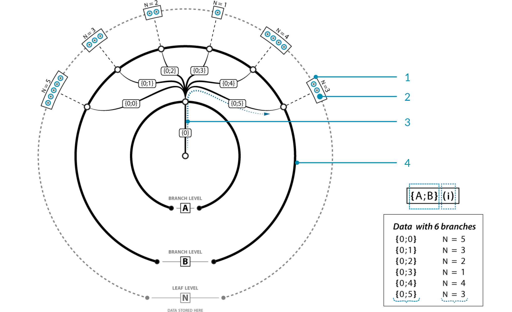

======================
Grasshopper, Continued
======================

Beyond just creating Python scripts in Grasshopper, we need to be able to understand
how data is structured within Grasshopper, and how type coercion works.

Type Coercion
=============

Type coercion is an automatic process where one type of data is converted to another.
This could be as simple as automatically converting a Vector3d to a Point3d, but it
can get more complicated.

For example, if you try to connect a curve node to a number node, that data provided to the
number node is not the curve, it is instead its length. This particular coercion isn't super
intuitive, but it demonstrates how some types can be quite generous with respect to
coercion. Not all conversions are possible, and the target node will be highlighted in
red if this is the case.

Grasshopper Data Structures
===========================

In Grasshopper, data will either be contained as a single item, in a list, or in a data
tree. Single items are this simplest, containing only one number, point, surface, etc.

.. admonition:: Fancy Wires
    :class: important

    Wires represent the connections and flow of data within your grasshopper definition.
    Extra information about the type of data being connected by wires can be seen by
    enabling "fancy wires." I'd highly recommend turning this on if it isn't already.
    To do so, turn on "Draw Fancy Wires" in the Display tab of the menu bar at the top.

    .. figure:: ../../_static/images/week4/wires.png
        :figwidth: 95%
        :align: left
        :figclass: only-light

        Types of fancy wires:

        1. Empty items are shown as an orange wire. This is not the same as a null item.
        2. Multiple sources can be combined by using the Merge component or by holding Shift while connecting an output to an input.
        3. Lists are shown as a grey double wire.
        4. Single items are shown as a solid grey wire.
        5. Data trees are shown with a grey, doubled, dash wire.

        Image Source: `Grasshopper Primer by Mode Lab <http://grasshopperprimer.com/en/1-foundations/1-4/7_working-with-lists.html>`__

    .. figure:: ../../_static/images/week4/wires.png
        :figwidth: 95%
        :align: left
        :figclass: only-dark light-background

        Types of fancy wires:

        1. Empty items are shown as an orange wire. This is not the same as a null item.
        2. Multiple sources can be combined by using the Merge component or by holding Shift while connecting an output to an input.
        3. Lists are shown as a grey double wire.
        4. Single items are shown as a solid grey wire.
        5. Data trees are shown with a grey, doubled, dash wire.

        Image Source: `Grasshopper Primer by Mode Lab <http://grasshopperprimer.com/en/1-foundations/1-4/7_working-with-lists.html>`__

Grasshopper Lists
-----------------

A list in Grasshopper is similar to a list in Python. It contains a sequence of items,
with indices starting at 0. Unlike Python, however, data in Grasshopper lists are
always the same type.

Creating Lists
^^^^^^^^^^^^^^

Depending on what you need the list for, you can create it in a handful of different
ways:

#. Multiple inputs: You can connect multiple wires to an input node by holding Shift
   while dragging the wire. This makes the new wire not replace the existing wire.
#. "Set Multiple": When right-clicking a parameter node in Grasshopper, you
   have the option of setting the parameter to a single value or setting multiple
   values for the parameter. In a geometry parameter, you can select multiple elements
   in the viewport to create the list (order matters!). In a primitive parameter, you
   can type the elements directly into a new-line separated list.
#. "Manage ... collection": When right-clicking a parameter node, you can manage the data
   collection directly. This brings up a window that allows you to add and remove items
   in the list.
#. In a panel: You can enter primitive data into a panel, with each item separated by a
   new line. Make sure that "Multiline Data" is deselected when you right click the
   panel.
#. Script components can create lists.
#. Other components:

   * Range
   * Series
   * Random

List Visualization
^^^^^^^^^^^^^^^^^^

Lists can be visualized by piping them into a panel, but it can often be useful to
have some sort of information displayed in the viewport to help you know what piece of
geometry is what in your list. There are a handful of components that can be used for this:

#. Point List: If your data can be coerced into a list of points, place a number at each point.
#. Text Tag: Place a ``TextDot`` at each point in a list, with provided text.
#. Text Tag 3d: Place a ``Text`` element at each point in a list, with provided text.
#. Custom Preview: Render each item in your list.

Grasshopper Data Trees
----------------------

Data trees are hierarchical structures used to store data in nested lists. Unlike lists,
which can be indexed, data trees can be accessed with paths. Paths are structured as
semi-colon delimited values in between two braces (e.g.: ``{0;0;1;2}``). Each index in
the path corresponds to a branch. When a path is as deep as it can go (i.e.: no more
branches can be taken), the branch at that path is a list containing the "leaves" of the
tree. These leaves are the data contained within the tree, and are accessed with a path
followed by the list index in parenthesis (e.g.: ``{0;0;1;2}(3)``).

.. note::

    Not all paths to leaves in a tree need to be the same length. Furthermore,
    the deepest branches containing the leaves do not all need to be the same size.

    Example data tree:

    #. The outermost ring contains the data of the tree, stored in the deepest branches as
       lists.
    #. An individual piece of data. Each corresponds to some path and index, ``{A;B}(i)``.
    #. The root branch of all paths in the tree. Technically, a data tree can have multiple
       root branches. Each corresponds to some path, ``{A}``.
    #. 6 branches pathing off from ``{0}``. Each corresponds to some path, ``{A;B}``.

    Image Source: `Grasshopper Primer by Mode Lab <http://grasshopperprimer.com/en/1-foundations/1-5/2_what-is-a-data-tree.html>`__

    Example data tree:

    #. The outermost ring contains the data of the tree, stored in the deepest branches as
       lists.
    #. An individual piece of data. Each corresponds to some path and index, ``{A;B}(i)``.
    #. The root branch of all paths in the tree. Technically, a data tree can have multiple
       root branches. Each corresponds to some path, ``{A}``.
    #. 6 branches pathing off from ``{0}``. Each corresponds to some path, ``{A;B}``.

    Image Source: `Grasshopper Primer by Mode Lab <http://grasshopperprimer.com/en/1-foundations/1-5/2_what-is-a-data-tree.html>`__

Creating Data Trees
^^^^^^^^^^^^^^^^^^^

Data trees can be created in a few ways:

#. "Manage ... collection": When right-clicking a parameter node, you can manage the data
   collection directly. This brings up a window that allows you to add and remove items
   in the collection. One of the buttons allows you to create new root paths in the data.
   You can edit these paths, but you may need to save and reopen the manager to edit
   the path of the first collection of data.
#. Script components can create data trees.
#. Data promotion.

.. admonition:: Data Promotion
    :class: important

    If a component outputs a single value given a single input, providing it with a list
    will make it output a list where each item in the output corresponds to the item at
    the same index in the input.

    If a component outputs a list given a single input, providing it with a list will make
    it output a tree where item ``i`` in the input corresponds to the output branch ``{0;i}``.
    If you instead provide it with a tree, the input path ``{path;in;input}(i)`` will
    correspond to the output branch ``{path;in;input;i}``.

    If a component outputs a tree given a single input, providing it with a list will *normally* make
    it output a tree where item ``i`` in the input corresponds to the output branch ``{0;i}``,
    with that branch being the tree that would have been created if that single item was
    inputted manually. Tree inputs are similar to the previous point.

    .. warning::

        This last point is not always the case, so being comfortable viewing outputted
        trees is important here. When working with script nodes, for example, the
        outputted tree might be trimmed.

Data Tree Visualization
^^^^^^^^^^^^^^^^^^^^^^^

Data trees can be visualized with the same tools as lists, but some care has to be
taken to ensure :ref:`data streams are matched correctly <data-stream-matching>`. There
are, however, some dedicated components for data tree visualization:

#. Param Viewer: You can either view the tree as text or in tree form, like in the figure
   above. To view the tree visually, right click and select "Draw Tree". The deepest
   branches are colored red, indicating they contain the lists of leaves.
#. Panels: By connecting a tree to a panel, you can view the leaves of the tree. Branches
   are separated by fields that indicate the path to that branch containing the leaves.
#. Tree Statistics: Enumerates all longest paths in the tree and the length of each branch
   at each longest path, and provides the number of longest paths in the tree.

Mutating Data Trees
^^^^^^^^^^^^^^^^^^^

Various components can be helpful when working with data trees:

#. Flatten: Collapse the entire data tree into a list, using a breadth-first search
   traversal. That is, take every longest path in the tree, in the same order as seen
   with the Tree Statistics node, and combine the lists at each path in that same order.
#. Graft Tree: Create a new data tree where every leaf is promoted to its own branch.
   That is, ``{path;in;input}(i)`` becomes ``{path;in;input;i}(0)``.
#. Simplify Tree: Take the smallest possible subtree such that all information is preserved.
   That is, if all paths in the tree start with the same subpath, remove that subpath. This
   creates multiple roots.
#. Flip Matrix: Flip a "matrix-like" tree by swapping rows and columns.
#. Path Mapper: Specify a custom lexical operation to map paths in the input tree to
   paths in the output tree. Given an input tree, some preset mappings can be generated
   by right-clicking the component.

There's a lot more than what's shown here, and you can see all of them in the Tree
section of the Sets tab.

.. note::

    Flattening, grafting, and simplifying can be done on an output or an input node,
    which can make it easier to work with data trees. Right-click the input or output
    and select the option. The corresponding icon will appear next to the input or
    output name, when activated.

.. _data-stream-matching:

Data Stream Matching
====================

Data matching is an important concept that pertains to how inputs with different paths
are handled by a node. This could be two lists of different lengths or two trees with
paths that don't match.

When working with lists, in general, if one input is shorter than the other (including
if that input is a single item), the last item in the shorter input will be repeated
in order to match the length of the second. This can be adjusted by using the following
components:

#. Shortest List: Shrink a collection of lists to the shortest length amongst them.
#. Longest List: Grow a collection of lists to the longest length amongst them.
#. Cross Reference: Create new lists that correspond to creating unique combinations
   from the input lists.

Each of these components have multiple algorithms for creating the outputted lists,
which can be selected by right-clicking the component. Hover over the algorithm to
read its description.

.. warning::

    The following is my heuristic understanding of data stream matching with trees. I
    don't know if any of this is true 100% of the time. Script nodes seem to behave
    weirdly with this, and I could be missing something.

When working with data trees, in general, if a node normally accepts single inputs,
any output is promoted to ensure every combination of leaves from the inputs will get
reflected in the output. If the input trees don't have the same path hierarchy, the output
hierarchy is determined by the "principal" input. That is, the output hierarchy will
first match that input's hierarchy. The principal input can be selected by right-clicking
and selecting "Principal".
