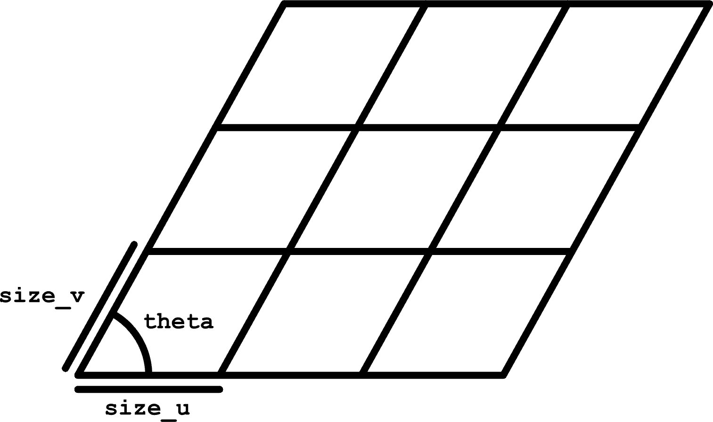
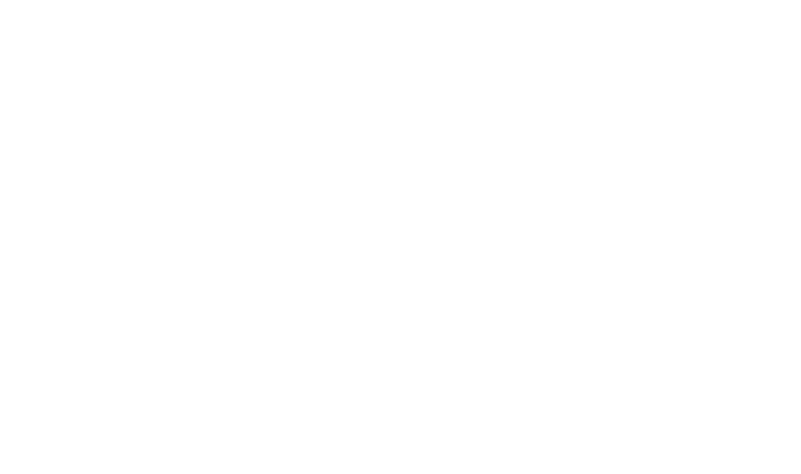
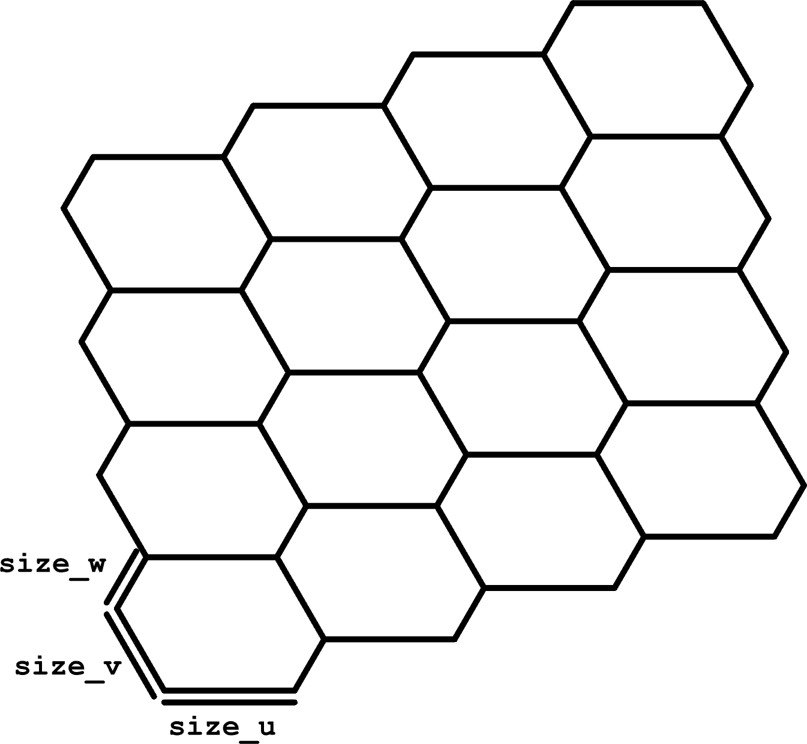
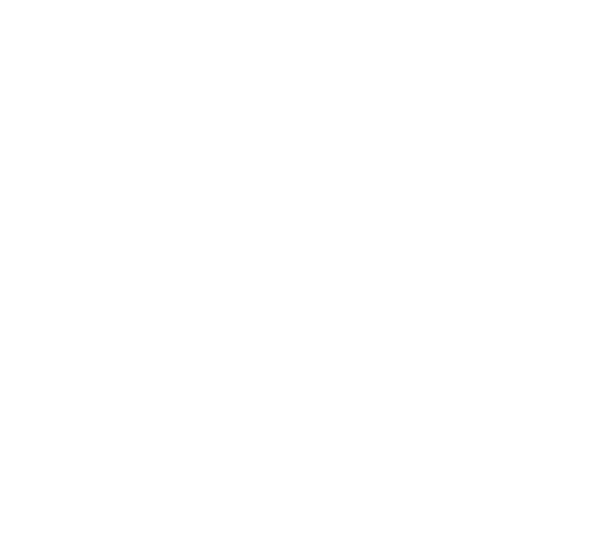
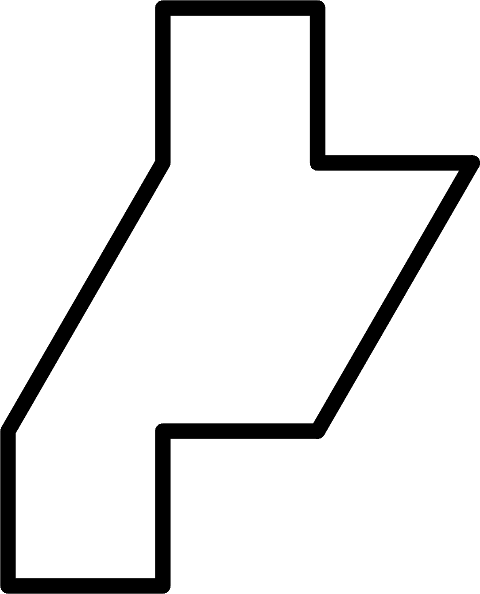
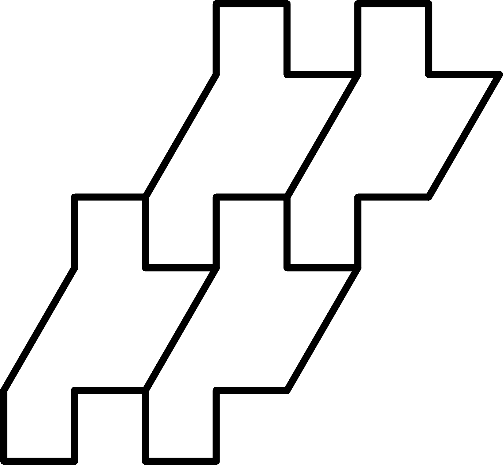
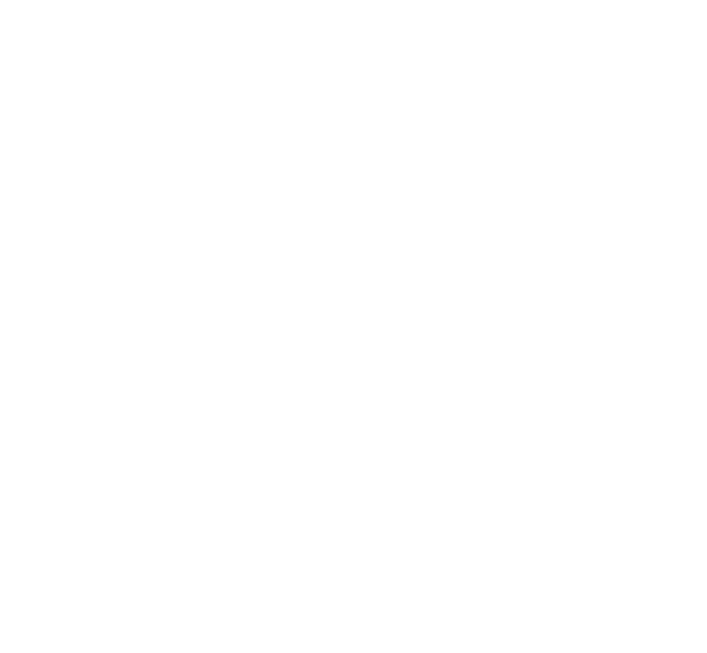

======================
Custom Grid Components
======================

We can make our own "custom grid components" using Python 3 Script components. This
page contains some (hopefully) interesting exercises in making customized grids.

.. note::

    You can get a completed Grasshopper document containing implementations for
    everything on this page :download:`here <../../_static/grasshopper-files/custom-tilings.gh>`.

Parallelogram Grids
===================

We can make our own parallelogram grids, extending the Rectangular component to
slanted grids. Of course, this could be done by shearing the cells or points created by
the Rectangular component, but using a Python 3 Script component is a pretty easy
way to make this work.

.. dropdown:: Inputs
    :open:

    * ``size_u``, type-hinted as float
    * ``size_v``, type-hinted as float
    * ``extent_u``, type-hinted as int
    * ``extent_v``, type-hinted as int
    * ``theta``, type-hinted as float

.. dropdown:: Outputs
    :open:

    * ``cells``, type-hinted as Polyline
    * ``points``, type-hinted as Point3d

.. dropdown:: Source Code

    .. code-block:: python

        from math import cos, sin, radians

        import ghpythonlib.treehelpers as th
        import rhinoscriptsyntax as rs
        from Rhino.Geometry import Vector3d

        theta = radians(theta)

        u_basis = size_u * Vector3d(1, 0, 0)
        v_basis = size_v * Vector3d(cos(theta), sin(theta), 0)

        # Generate points
        points = []
        for u in range(extent_u + 1):
            row = []
            for v in range(extent_v + 1):
                row.append(u * u_basis + v * v_basis)
            points.append(row)

        # Generate cells
        cells = []
        for u in range(extent_u):
            row = []
            for v in range(extent_v):
                row.append(rs.AddPolyline(
                    [
                        points[u][v],
                        points[u + 1][v],
                        points[u + 1][v + 1],
                        points[u][v + 1],
                        points[u][v]  # repeat the first point to make a closed loop
                    ]
                ))
            cells.append(row)

        points = th.list_to_tree(points)
        cells = th.list_to_tree(cells)

Generic Hexagonal
=================

We can generalize the Hexagonal component to vary the lengths of the 3 pairs of parallel
sides on each hexagon. For this type of grid, we don't care as much about the corner
points of the grid because, as in Hexagonal, attempting to index the grid points isn't
as straightforward as it is with a rectilinear grid.

To create this type of grid, it's easier to use a basis with more than 2 vectors in
order to find the corners of the cells, then use the corners of the cells to compute
their centroids.

.. dropdown:: Inputs
    :open:

    * ``size_u``, type-hinted as float
    * ``size_v``, type-hinted as float
    * ``size_w``, type-hinted as float
    * ``extent_u``, type-hinted as int
    * ``extent_v``, type-hinted as int
    * ``extent_w``, type-hinted as int

.. dropdown:: Outputs
    :open:

    * ``cells``, type-hinted as Polyline
    * ``points``, type-hinted as Point3d

.. dropdown:: Source Code

    .. code-block:: python

        from math import cos, sin, pi

        import ghpythonlib.treehelpers as th
        import rhinoscriptsyntax as rs
        from Rhino.Geometry import Vector3d

        u_basis = size_u * Vector3d(1, 0, 0)
        v_basis = size_v * Vector3d(cos(-pi / 3), sin(-pi / 3), 0)
        w_basis = size_w * Vector3d(cos(pi / 3), sin(pi / 3), 0)

        # Generate cells and points in tandem
        cells = []
        points = []
        for i in range(extent_right):
            cell_row = []
            point_row = []
            for j in range(extent_up):
                west_corner = i * (u_basis + w_basis) + j * (w_basis - v_basis)
                corners = [
                    west_corner,
                    west_corner + v_basis,
                    west_corner + v_basis + u_basis,
                    west_corner + v_basis + u_basis + w_basis,
                    west_corner + u_basis + w_basis,
                    west_corner + w_basis,
                    west_corner
                ]
                cell_row.append(rs.AddPolyline(corners))
                point_row.append(sum(corners[:-1], start=Vector3d(0, 0, 0)) / 6)
            cells.append(cell_row)
            points.append(point_row)

        cells = th.list_to_tree(cells)
        points = th.list_to_tree(points)

Generic Regular Monotilings
===========================

In general, you can use a strategy similar to the one we used for the hexagonal grid to
generate any regular tiling using a monotile. We need to be able to identify the vectors
used in the construction of the monotile.

    The monotile of choice.

    How this monotile tiles.

    The monotile of choice.

    How this monotile tiles.

.. rst-class:: clear-left clear-right

.. raw:: html

     

We can choose a start point on the monotile, create the remaining points by adding
these vectors, and identify which point makes the start point on a neighbor tile. Starting
at the bottom of the left slanted line, this monotile can be created by chaining together
the following vectors:

.. math::

    \begin{flalign}
    &\begin{bmatrix}
        0 & \frac{-1}{2}
    \end{bmatrix}\\
    &\begin{bmatrix}
        \frac{1}{2} & 0
    \end{bmatrix}\\
    &\begin{bmatrix}
        0 & \frac{1}{2}
    \end{bmatrix}\\
    &\begin{bmatrix}
        \frac{1}{2} & 0
    \end{bmatrix}\\
    &\begin{bmatrix}
        \frac{\sqrt{3}}{2} & \frac{1}{2}
    \end{bmatrix}\\
    &\begin{bmatrix}
        \frac{-1}{2} & 0
    \end{bmatrix}\\
    &\begin{bmatrix}
        0 & \frac{1}{2}
    \end{bmatrix}\\
    &\begin{bmatrix}
        \frac{-1}{2} & 0
    \end{bmatrix}\\
    &\begin{bmatrix}
        0 & \frac{-1}{2}
    \end{bmatrix}\\
    &\begin{bmatrix}
        \frac{-\sqrt{3}}{2} & \frac{-1}{2}
    \end{bmatrix}\\
    \end{flalign}

.. dropdown:: Computing the Vectors for Any Monotile
    :color: warning
    :name: monotile-computation

    I specifically chose these vectors to make an interesting shape and tiling, but you could
    start with a regularly tiling monotile and calculate the vectors needed after the fact, too.

    To do this, create a Python 3 Script component with an input called ``monotile``,
    type-hinted as Polyline. Pipe a Curve input set to your monotile polyline to
    ``monotile``. Place points at the start point of your monotile and the location
    of the next tile to the right and the next tile up from the initial monotile
    (see the example image). Set 3 point inputs to these points and pipe them to
    Point3d inputs called ``start``, ``right_start``, and ``up_start``, respectively.
    Make an output called ``path``, type-hinted to Vector3d, and two called ``right_index``
    and ``up_index``, type-hinted to int.

    Pasting the following code into the script block, ``path`` should be a list of
    vectors suitable to construct your monotile. ``right_index`` and ``up_index``
    will be set to the indices of the points in the path where the tile to the right
    and up will start.

    .. code-block:: python

        from Rhino.Geometry import Polyline, Point3d, Vector3d

        start_index: int = monotile.FindIndex(lambda x: start.EpsilonEquals(x, 1e-6))
        right_index: int = monotile.FindIndex(lambda x: right_start.EpsilonEquals(x, 1e-6))
        up_index: int = monotile.FindIndex(lambda x: up_start.EpsilonEquals(x, 1e-6))

        points = list(monotile)
        points = points[start_index:] + points[:start_index]
        right_index -= start_index
        if right_index < 0:
            right_index += len(points)
        up_index -= start_index
        if up_index < 0:
            up_index += len(points)

        path = []
        for i in range(1, len(points)):
            path.append(points[i] - points[i - 1])
        path.append(points[-1] - points[0])

Assuming you have a path of vectors corresponding to each step in the path and the indices
corresponding to the steps in the path where the tiles to the right and above start, you
can create a new Python 3 Script with the following setup:

.. dropdown:: Inputs
    :open:

    * ``extent_right``, type-hinted as int
    * ``extent_up``, type-hinted as int
    * ``path``, type-hinted as Vector3d, set to List Access
    * ``right_index``, type-hinted as int
    * ``up_index``, type-hinted as int

    ``path``, ``right_index``, and ``up_index`` be piped directly from the outputs of
    the :ref:`path calculation script component <monotile-computation>`. Alternatively,
    you can enter them directly in panels.

.. dropdown:: Outputs
    :open:

    * ``cells``, type-hinted as Polyline

.. dropdown:: Source Code

    .. code-block:: python

        import ghpythonlib.treehelpers as th
        import rhinoscriptsyntax as rs
        from Rhino.Geometry import Vector3d

        cumulative_vectors = [Vector3d(0, 0, 0)]
        for i, step in enumerate(path):
            cumulative_vectors.append(cumulative_vectors[i] + step)

        basis_right = cumulative_vectors[right_index]
        basis_up = cumulative_vectors[up_index]

        cells = []
        for i in range(extent_right):
            row = []
            for j in range(extent_up):
                start_point = i * basis_right + j * basis_up
                points = [
                    start_point + vector
                    for vector in cumulative_vectors
                ]
                row.append(rs.AddPolyline(points))
            cells.append(row)

        cells = th.list_to_tree(cells)
