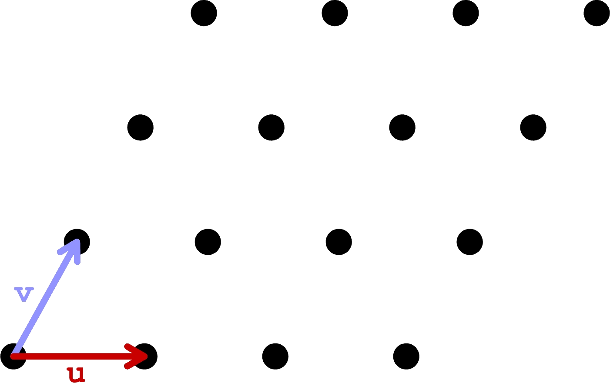
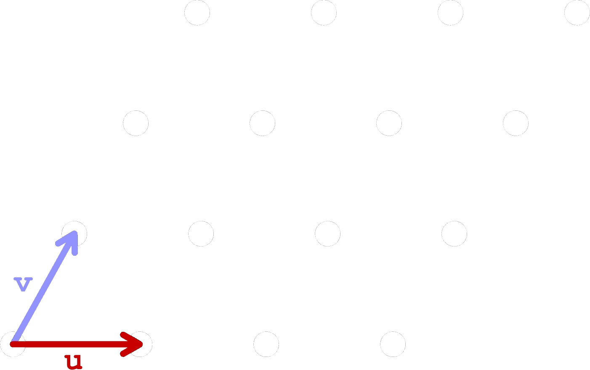

==================
Working with Grids
==================

Now that we've got vectors explained, we'll go over different ways of creating grids,
and some different use-cases for grids.

Grids by Vectors
================

Generally, we'll be starting with 2-dimensional grids. While these are in :math:`\mathbb{R}^3`
and made with ``Vector3d``, we only need two basis vectors (:math:`\mathbf{u}`
and :math:`\mathbf{v}`) to create every point in the grid. We can just set the z
component of these vectors to 0.

Furthermore, it's often useful to use the integers (:math:`\mathbb{Q}`) as your field
when building grids from vectors. This lets you use integers for :math:`a` and :math:`b` in
:math:`\mathbf{w} = \begin{bmatrix}a & b & 0\end{bmatrix} = a\mathbf{u} + b\mathbf{v}`.
If you then store grid points in a data tree or list of lists, the grid point at
``grid[a][b]`` is simply :math:`a\mathbf{u} + b\mathbf{v}`.

Choosing a different basis can let you create interesting grids. For example, the hexagonal and
triangular grid components in Grasshopper create grid points using basis vectors that are
:math:`30\deg` apart. The center points of hexagons in a hexagonal grid are equivalent
to the corners of triangles in a triangles in a triangular grid, and vice versa. Square grids
can be made with the standard basis of :math:`\begin{bmatrix}1 & 0 & 0\end{bmatrix}` and
:math:`\begin{bmatrix}0 & 1 & 0\end{bmatrix}` or with :math:`\begin{bmatrix}1 & 0 & 0\end{bmatrix}`
and :math:`\begin{bmatrix}1 & 1 & 0\end{bmatrix}`, the latter of which is indexed diagonally.

.. note::

    The grid used in :doc:`../../assignments/2-2D-cubies` is actually made with 3 basis
    vectors instead of 2, even though its a 2D grid. This is because the grid is a projection
    of a cube onto the XY plane. Using 3 basis vectors means each point in the grid
    can be made with an infinite number of combinations of the basis vectors, but
    given the nature of the problem, this is totally acceptable.

    The basis vectors used are:

    .. math::
        \begin{flalign}
        \mathbf{u} &= \begin{bmatrix}
            \frac{\sqrt{3}}{2} & -\frac{1}{2} & 0
        \end{bmatrix}&&\\
        \mathbf{v} &= \begin{bmatrix}
            \frac{\sqrt{3}}{2} & \frac{1}{2} & 0
        \end{bmatrix}&&\\
        \mathbf{w} &= \begin{bmatrix}
            0 & 1 & 0
        \end{bmatrix}&&
        \end{flalign}

    and each correspond to the projected version of the corresponding basis of the
    cube we're projecting onto the XY plane. ``get_point(u, v, w)`` just computes
    :math:`u\mathbf{u} + v\mathbf{v} + w\mathbf{w}`.

Making Grids
============

.. toctree::
    :titlesonly:
    :glob:

    *
