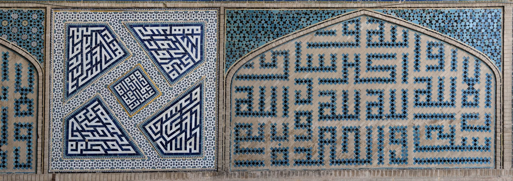
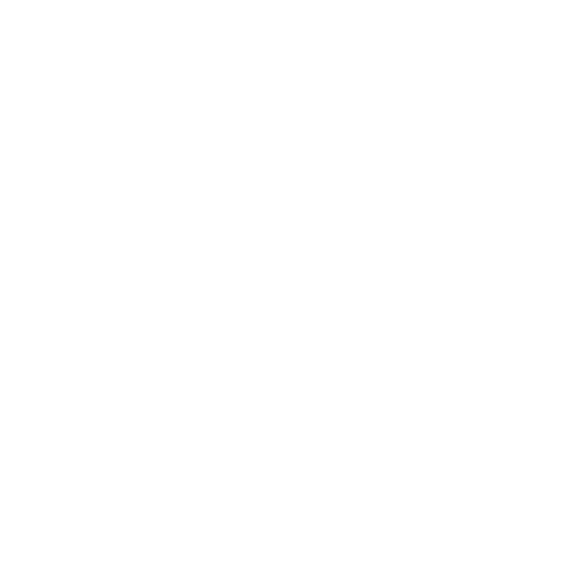

================================================
Taking Inspiration from Square Kufic Calligraphy
================================================

In Fall 2024, during one of my classes, I saw a presentation about Islamic architecture,
and one slide really caught my eye. It was a picture of the Northwest iwan of the
Friday Mosque of Isfahan *(Masjid-i Jami' (Isfahan))*, which contains several mosaics
containing `Square Kufic script <https://en.wikipedia.org/wiki/Kufic#Square_Kufic>`__:

    *Masjid-i Jami' (Isfahan), Northwest iwan, detail view of square kufic calligraphic
    panels on right interior side wall. Photo credit: Daniel C. Waugh, Aga Khan
    Documentation Center at MIT.* Source_

When I first saw these mosaics, I had no idea they were a type of calligraphy. Instead,
I saw interesting, abstract patterns that sprawl around, separated by empty space. I wanted
to see if there was some process that could be used to create similar patterns (apparently,
artists in the Middle Ages and the Renaissance who knew it was text tried to imitate
Kufic calligraphy with illegible `pseudo-Kufic <https://en.wikipedia.org/wiki/Pseudo-Kufic>`__).

    *A recreation of my attempt to create similar patterns to those that I perceived in
    the square Kufic mosaics.*

    *A recreation of my attempt to create similar patterns to those that I perceived in
    the square Kufic mosaics.*

Not seeing these mosaics as calligraphy created an interesting challenge for me, in which
I tried to understand the logic and rules behind the design language of the sprawling
patterns. Although these rules aren't consistent by nature of the patterns being calligraphy,
when drawing my own version imitating the patterns, I stuck to having the joints of
the patterns being aligned to a grid and the joints of the gaps being aligned to a
different grid. I tried to make sure that none of the patterns were one grid cell in
size, even though these can be seen in the square Kufic. By extending the grids, I was
able to extend the patterns out until I was happy with what I had. It doesn't look
like square Kufic, but it fits the general rules I perceived in the square Kufic
from the mosque. On the next page, I'll go over how I refined my process into something
that a Python script could do.

Manual Design Activity
======================

As a little activity, take some time to identify a manual process to create some sort of
abstract, irregular pattern or geometry. Feel free to take inspiration from the square
Kufic mosaics as I did or from some other real-world precedent. You could try to recreate
the precedent using your own process, or you could make something new with the precedent
in mind.

Take care to establish the process itself. Think about each decision you make, and try
to identify any sort of consistencies in your decisions. Later, we'll talk about how
you might refine your processes into something that you can do programmatically.

.. _Source: https://www.archnet.org/sites/1621
