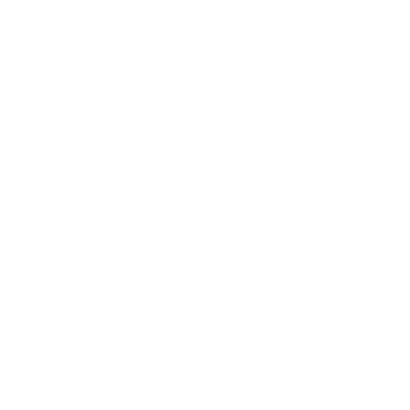
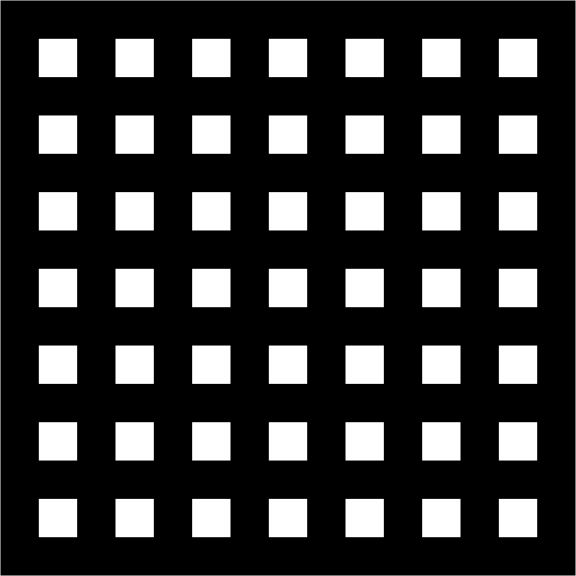
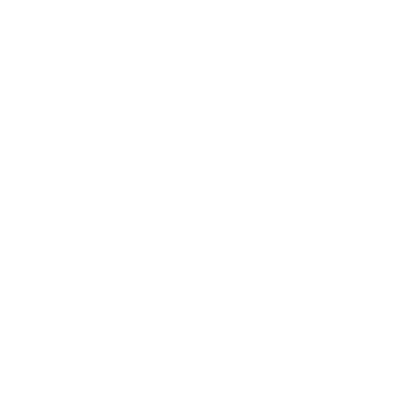
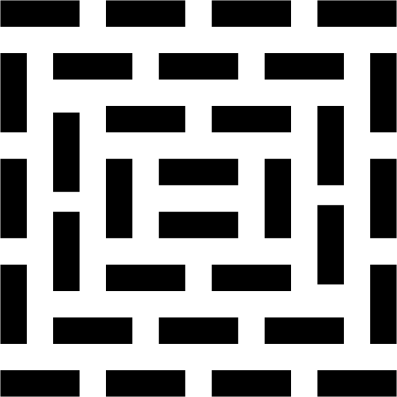
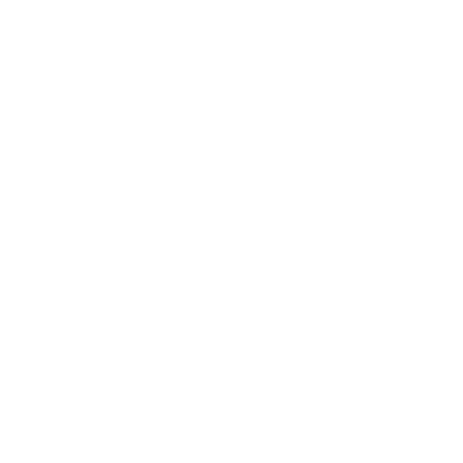
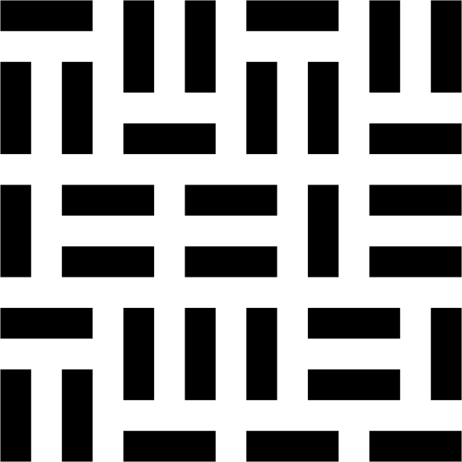
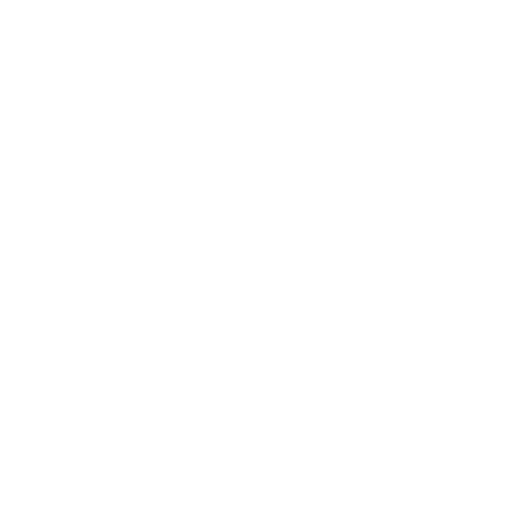

======================
Designing Assignment 3
======================

When creating patterns with the rules I had devised, I saw two strategies for generating
them. One way is to start with a grid of squares and connect them as you go (an additive
approach), while the other was to start with all the connections in place and erase
them as you go (a subtractive approach).

    *The initial grid for the additive approach*

    *The initial grid for the additive approach*

    *The initial grid for the subtractive approach*

    *The initial grid for the subtractive approach*

.. rst-class:: clear-left clear-right

.. raw:: html

     

Both approaches are equally viable for a manual process, but trying to adapt them to
a programmatic process comes with pros and cons for both.

.. list-table:: Analysis
   :widths: 10 70 70
   :header-rows: 1
   :stub-columns: 1

   * -
     - Additive
     - Subtractive
   * - Pros
     - * Adding connections doesn't require checking group sizes
       * Connections can be added in any order
     - * Easier to randomize
       * Could be done with a maze-solver
   * - Cons
     - * Harder to randomize
       * Have to check that you don't leave any cells unconnected
     - * Have to check that you don't create any 1-cell clusters
       * Need to constantly track which cells are in which group
       * Updating cell membership when removing connections is tricky

The subtractive method would be very easy if not for one condition: no grid cells are
left completely unconnected from any other cell. In order to check this, you'd need to
track information about which cells are connected, which would also require finding a
way to recognize when a group is split off from another. This sounded quite complicated,
and would have probably required a complicated data structure.

This makes the additive method more appealing, especially if it isn't as complicated.
The tricky part of the additive method is that you need to make sure that you don't
leave any cells unconnected. This could be done with something like the following:

.. code-block:: python

    while there_are_unconnected_cells:
        # Connect an unconnected cell to a random neighbor

One downside of this approach though, is that you'd likely end up with small group,
something like the following, in the worst case:

.. rst-class:: clear-left clear-right

.. raw:: html

     

There are a couple of ways that this could be resolved, such as making a connection
to the neighbor cell that is connected to the biggest cluster. The solution I went with
is to instead create a set number of clusters and randomly add points adjacent to a group
to the smallest group they're adjacent to. This strategy tends to make clusters of a variety
of sizes. This does require keeping track of which cluster each cell is a part of.

Programmatic Design Activity
============================

With the manual process you devised from the last page, what sort of information would
you need so that it can be performed by a computer? How would you need to change your
process so that it can be performed by a computer?
