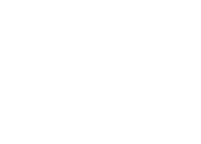
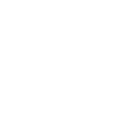
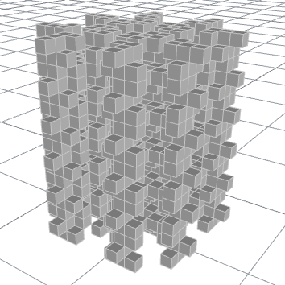
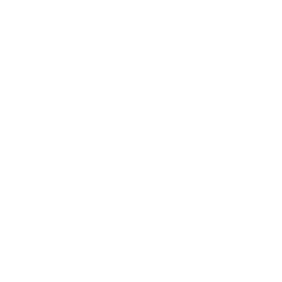
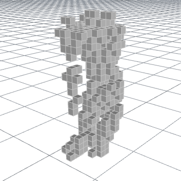

=================
Cellular Automata
=================

A cellular automaton is a discrete model of computation consisting of a regular
grid of cells, each of which can be in one of a finite number of states. Rules can be
applied to every cell in the grid to determine how the grid updates over time. Generally,
rules don't change and aren't random.

    "Gosper's glider gun", an infinite loop in Conway's Game of Life.
    *By Lucas Vieira - Own work, CC BY-SA 3.0,* |glider-gun|_

    "Gosper's glider gun", an infinite loop in Conway's Game of Life.
    *By Lucas Vieira - Own work, CC BY-SA 3.0,* |glider-gun|_

Stacking Conway's Game of Life
==============================

One of the most common examples of cellular automata is Conway's Game of Life, where
grid cells are either "dead" or "alive", and the grid updates according to the following
rules each iteration:

#. Living cells with two or three living neighbors remain alive, all other living cells
   die.
#. Dead cells with exactly three living neighbors become alive, all other dead cells
   remain dead.

The "neighborhood" of a cell (i.e. the set of cells that are considered neighbors of
any given cell) can be whatever you want, but in the Game of Life, the neighborhood of
a cell is the 4 cells up, down, left, and right, and the 4 diagonally connected cells.
This is called the `Moore neighborhood <https://en.wikipedia.org/wiki/Moore_neighborhood>`__
and is not the only possible option.

The Game of Life is played on an infinite or toroidal (boundary-wrapping) grid, where
you can choose any initial state. The game plays itself, updating the grid indefinitely
for you to see what your initial state gives rise to.

On it's own, the Game of Life doesn't create any sort of designs, as it's emphasis is
more on showing an animation of sorts. That being said, it's possible to convert these
"animations" into a 3D volume by stacking each iteration on top of its predecessor, creating
a 3D voxel grid.

    "Pulsar", an oscillator of period 3.

    "Pulsar", an oscillator of period 3.

    A 3D-stacked pulsar.

.. rst-class:: clear-left clear-right

.. raw:: html

     

Oscillators create stacks that could extend upwards infinitely with a repeating pattern,
but many initial configurations lead to a finite number of steps before a steady state
is reached, such as with two gliders on a toroidal surface that crash into each other.

    Two gliders on a toroidal grid.

    Two gliders on a toroidal grid.

    The stack created by the two gliders crashing.

.. rst-class:: clear-left clear-right

.. admonition:: RLE code for crashing gliders

    You can paste the following RLE code into https://conwaylife.com/ to see the evolution
    of the initial state.

    .. code-block:: none

        x = 6, y = 6, rule = B3/S23:T9,9
        3b3o$5bo$4bo$b2o$obo$2bo!

Conway's Game of Life is just one example of cellular automata. Choosing different types
of rules, boundary conditions, and grid types will allow us to create wildly different
results. You'll be implementing a simpler version of cellular automata for
:doc:`../assignments/4-elementary-cellular-automaton`. Updating rules partway through
the iterations or randomly selecting which rule to apply for each case can also create
interesting affects.

Understanding Elementary Cellular Automata
==========================================

.. admonition:: TODO
    :class: error

    Fill out

.. |glider-gun| replace:: *https://commons.wikimedia.org/w/index.php?curid=101736*
.. _glider-gun: https://commons.wikimedia.org/w/index.php?curid=101736
