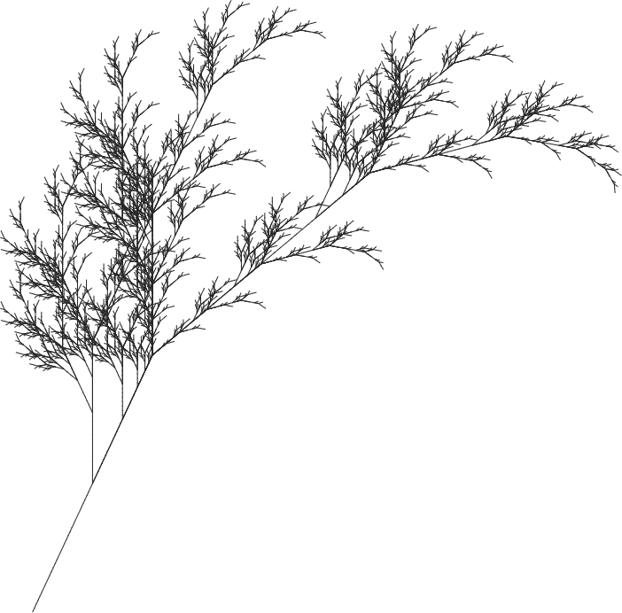

===================
Lindenmayer Systems
===================

Lindenmayer systems (L-systems for short) are similar to cellular automata in that
you create rules that are applied iterative to a current design. L-systems, however,
are based on a computational device called a "grammar". In general, an L-system is defined
with the following components:

* Variables: Symbols that will be replaced each iteration.
* Constants: Symbols that will never be replaced.
* Axiom: The initial state, a sequence of variables and constants.
* Rules: A set of rules for how to replace variables in the current state with new sequences of symbols.

.. admonition:: Example L-system

    This is an example L-system that, as it is, isn't practical for design at all.

    * Variables: :math:`A` and :math:`B`
    * Constants: None
    * Axiom: :math:`A`
    * Rules: :math:`(A \rightarrow AB)` and :math:`(B \rightarrow A)`

    At iteration :math:`n = 0`, the state will only be :math:`A`, the axiom.
    It evolves as follows:

    .. math::

        \begin{align}
        n=0 \; : \; &A \\
        n=1 \; : \; &AB \\
        n=2 \; : \; &ABA \\
        n=3 \; : \; &ABAAB \\
        n=4 \; : \; &ABAABABA \\
        n=5 \; : \; &ABAABABAABAAB \\
        n=6 \; : \; &ABAABABAABAABABAABABA \\
        n=7 \; : \; &ABAABABAABAABABAABABAABAABABAABAAB
        \end{align}

    If you look at the lengths of these strings, you'll see that they're actually the
    Fibonacci sequence.

    Note that at each iteration, all variables are replaced according to the rules, *at
    the same time*. Applying only a single rule to a single variable is not allowed.

Using L-Systems for Design
==========================

To get from an L-system to a design, the symbols in the system are often translated to
instructions for a "turtle" to follow. Generally, these look like "move forward", "turn",
"remember where you are", and "go back to where you last remembered".

As a simple example, the following L-system generates a Koch curve with only right angles:

* Variables: :math:`F`
* Constants: :math:`+` and :math:`-`
* Axiom: :math:`F`
* Rules: :math:`(F \rightarrow F+F-F-F+F)`

Here, :math:`F` means "move forward", :math:`+` means "turn left", and :math:`-` means
"turn right". After a handful of iterations, we can draw the turtle's path:

.. figure:: https://upload.wikimedia.org/wikipedia/commons/a/ab/Square_koch.svg
    :align: left

    :math:`n = 0`

.. raw:: html

     

.. figure:: https://upload.wikimedia.org/wikipedia/commons/1/18/Square_koch_1.svg
    :align: left

    :math:`n = 1`

.. raw:: html

     

.. figure:: https://upload.wikimedia.org/wikipedia/commons/e/ec/Square_koch_2.svg
    :align: left

    :math:`n = 2`

.. raw:: html

     

.. figure:: https://upload.wikimedia.org/wikipedia/commons/d/d6/Square_koch_3.svg
    :align: left

    :math:`n = 3`

.. rst-class:: clear-left clear-right

.. raw:: html

     

Multiple variables can be set to the same turtle instruction, as with the dragon curve:

* Variables: :math:`F` and :math:`G`
* Constants: :math:`+` and :math:`-`
* Axiom: :math:`F`
* Rules: :math:`(F \rightarrow F+G)` and :math:`(G \rightarrow F-G)`
* Turn angle: :math:`90^\circ`

Here, :math:`F` and :math:`G` both mean draw forward. After 10 iterations, the dragon
curve can be seen by the turtle's path:

.. figure:: https://upload.wikimedia.org/wikipedia/commons/1/11/Dragon_curve_L-system.svg
    :figwidth: 100%

Saving the Turtle's Position and Rotation
-----------------------------------------

In many cases, it can be helpful to save information about where the turtle is and where
it's facing. This can allow for branching behavior. This is often facilitated with
a "last-in, first-out" stack. The idea of such a stack is that you can "push" the turtle's
current position and heading onto the stack and "pop" off the top of the stack to return
the turtle to the *most recently pushed* position and heading. You can think of it like
a stack of papers where you can only take off the top and add new pages to the top.

These instructions are usually assigned unique constants: :math:`[` for push and
:math:`]` for pull. This provides a convenient way to read the rules. We can see these
being used in a more complicated L-system:

* Variables: :math:`X` and :math:`F`
* Constants: :math:`+`, :math:`-`, :math:`[`, and :math:`]`
* Start: :math:`-X`
* Rules: :math:`\left(X \rightarrow F+\left[\left[X\right]-X\right]-F\left[-FX\right]+X\right)` and :math:`(F \rightarrow FF)`
* Turn angle: :math:`25^\circ`

Here, :math:`X` is a "do nothing" instruction that helps facilitate the growth of
the tree. After 6 iterations, the turtle's path looks like:

Hopefully you can see that by tweaking the rules and parameters of the L-system, you
can create incredibly complicated fractal designs. As with cellular automata, you could
change the rules partway through the iterations or randomly select a rule to apply to each
variable at each iteration, which can produce incredibly complex designs.
