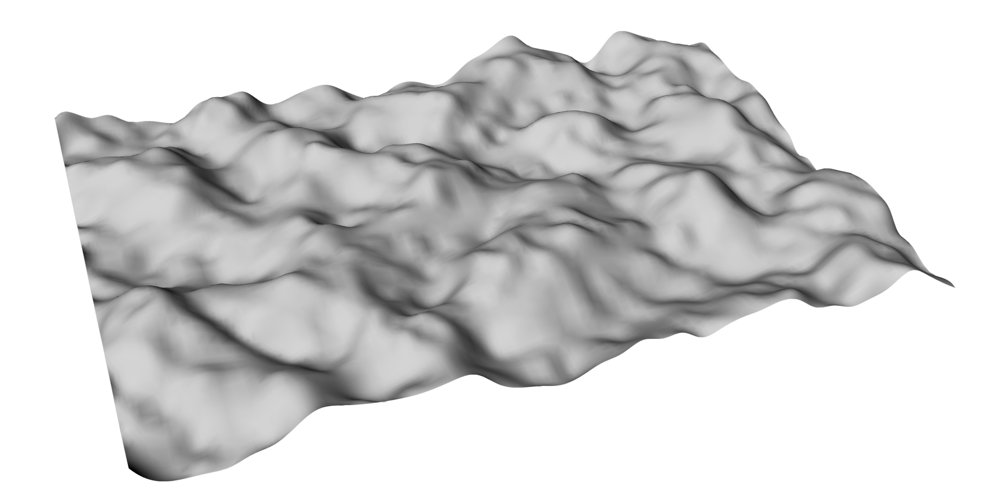

===========================
Using Open-Source Libraries
===========================

One of the most powerful aspects of Python is its multitude of open-source libraries
that are available to use in any project. Although not all of these are compatible
with Grasshopper, and many aren't necessarily useful for designing something, they
can be incredibly helpful for not having to reinvent the wheel.

The Python Package Index
========================

The `Python Package Index <https://pypi.org/>`__ is a huge repository of public libraries
that you can use in your Python projects. To find a library that can do a specific
thing, you can either search directly on the site or search with your preferred search
engine (if you do that, you'll probably want your query to include "python" and either
"library" or "package").

Virtual Environments
====================

In a general Python project, it's good practice to set up what's called a *virtual
environment* for the project. This is a way to keep the libraries your project uses
separate from those another project uses. Rhino and Grasshopper handle the creation
of a virtual environment for you, but if you wanted to work on a project outside of
Rhino or Grasshopper and want to set up a virtual environment, you can use one of the
following tools:

* The builtin ``venv`` package (https://docs.python.org/3/library/venv.html)
* The ``virtualenv`` package (https://virtualenv.pypa.io/en/latest/)
* Conda, an environment manager with alternative package indices (https://docs.conda.io/en/latest/)

  * Personally, I use Conda for everything because it's easy to create virtual environments
    that can be shared with multiple projects and managed from the desktop GUI.

* And many more...

Installing Libraries
====================

Traditionally, once your virtual environment has been activated, libraries would be
installed using a command:

.. code-block:: sh

    pip install <library-name>

This installs the library into your virtual environment and runs any additional setup
steps.

Because Grasshopper handles the virtual environment for us, we don't have to do this.
Instead, if you want to use a library from PyPI in your Python 3 component, you'd
place a comment at the top of your file:

.. code-block:: python

    # r: <library-name>

You can do one of these for each library you'd want to use. You can optionally specify
a version specifier:

.. code-block:: python

    # r: <library-name>==<version-number>

Take a look at the `Version Specifiers Spec <https://packaging.python.org/en/latest/specifications/version-specifiers/#id5>`__
for more details on what version specifiers you can use.

Example: Gradient Noise
=======================

    A heightmap created by layering multiple octaves of OpenSimplex noise.

.. note::
    A completed, downloadable version of this example is available here:
    :download:`../_static/grasshopper-files/simplex-heightmap.gh`

Gradient noise is a type of noise that is perceptually "smoother" than noise generated
by repeated PRNG calls alone. We won't go into the math here, so don't worry.

The first implementation of gradient noise was created by Ken Perlin, aptly named Perlin
noise. It was originally developed to create procedural textures for the original Tron
movie, but has since been used for procedural terrain and particle systems. Since its
creation, other types of gradient noise, like fractal and simplex noise, have become
incredibly popular.

For this example, we'll be using OpenSimplex noise, which was created to get around the
patent Ken Perlin had registered for simplex noise. We'll be using it to create a 2.5D
height map, similar to what we had done when first learning about :ref:`Randomized Height
Maps`. To do this, we'll be installing the ``opensimplex`` library.

Creating a new Grasshopper file, we can create a new Python 3 component:

* **Inputs:**

  * ``point``: type-hinted to Point3d, set to Item Access
  * ``seed``: type-hinted to int, set to Item Access

* **Outputs:**

  * ``point``: type-hinted to Point3d

Inside, we can include the following code:

.. code-block:: python

    # r: opensimplex

    import opensimplex
    if seed is not None and isinstance(seed, int):
        # This check is just to make sure we don't crash Rhino if the seed input isn't connected
        opensimplex.seed(seed)
    point.Z = opensimplex.noise2(point.X, point.Y)

Now that we have this, we can connect a Square grid component into the ``point`` input,
connect a slider into the ``seed`` input, and use a Surface from Points component
from the ``point`` output.

.. important::
    When using the Surface from Points component on the ``point`` output, make sure the
    Points input is flattened, and pass 1 more than the Extent X used for the Square grid
    component into the U Count input.

Adding Octaves
--------------

A common practice with creating procedural textures and terrain with gradient noise is
layering multiple "octaves" on top of each other. What this looks like is you generate
multiple noise values for each point in the grid and add them together, but the noise
generated has smaller and smaller amplitude, and the apparent size of high and low patches
gets smaller and smaller as you add in more terms.

What this looks like is:

.. math::

    z = \sum_{i=0}^{n}A_i \cdot noise(x \cdot f_i, y \cdot f_i)

Where :math:`A_i` are the amplitudes and :math:`f_i` are the "frequencies" of your
chosen layers. Higher frequencies mean smaller patches. These are called octaves because
normally, it's good to choose a base frequency and then layer in noise generated at
integer multiples of that base frequency (like octaves for sound waves).

To support this, we need to add 2 more inputs to the Python script:

* ``frequencies``: type-hinted to float, set to List Access
* ``amplitudes``: type-hinted to float, set to List Access

.. important::
    It's incredibly important that these are set to List Access. If you don't do that,
    this won't work.

We can update the code, too:

.. code-block:: python

    # r: opensimplex

    import opensimplex
    if seed is not None and isinstance(seed, int):
        # This check is just to make sure we don't crash Rhino if the seed input isn't connected
        opensimplex.seed(seed)

    for freq, amp in zip(frequencies, amplitudes):
        point.Z += amp * opensimplex.noise2(point.X * freq, point.Y * freq)

Now, to control the amplitudes and frequencies, we can use a bunch of sliders, fed into
two Merge components, fed into these two new inputs. Note that the
:external+python:func:`zip` function will pair up items in the input lists until one
is exhausted, so if you have frequencies than amplitudes, it will stop short once
all amplitudes are used.

Using gradient noise with multiple layers can give you incredibly fine-grained control
over a heightmap's generation, which can allow you to create fairly realistic terrain.
Combining layers in other ways, such as having amplitudes that increase near an attractor
point to get the semblance of a mountain, can give even more control.
